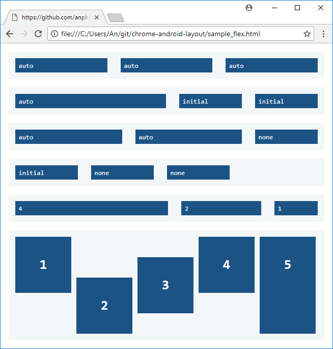

## chrome android layout

This program can convert moderately complex HTML pages into the standard XML layouts for Android. iOS and Xamarin Forms can also be supported once the Android version is stable. HTML is the most popular and versatile way to design user interfaces and can be used to generate the UI for any platform based on XML. Currently the generated XML can be imported into your Android projects as a foundation for your layout design.

INSTALLATION

```javascript
<script src="utils.js"></script>
<script src="color.js"></script>
<script src="constants.js"></script>
<script src="node.js"></script>
<script src="layout.js"></script>
<script>
    document.addEventListener('DOMContentLoaded', () => {
        console.log(parseDocument());
        console.log(writeResourceStringXml());
        console.log(writeResourceArrayXml());
        console.log(writeResourceStyleXml());
        console.log(writeResourceColorXml());
        console.log(writeResourceDrawableXml());
    });
</script>
```
These settings are available in layout.js to customize your desired XML structure.

```javascript
const SETTINGS = {
    targetAPI: 21,
    density: DENSITY_ANDROID.MDPI,
    showAttributes: true,
    useConstraintLayout: true,
    useConstraintChain: true,
    useGridLayout: false,
    useLayoutWeight: false,
    useUnitDP: true,
    useRTL: true,
    resourceValueNumber: false,
    boundsOffset: 2,
    whitespaceHorizontalOffset: 4,
    whitespaceVerticalOffset: 14,
    constraintBiasBoxOffset: 14,
    chainPackedHorizontalOffset: 4,
    chainPackedVerticalOffset: 14
};
```
You can preview the library with the provided sample.html or sample_flex.html which should generate the same XML you see here in the README. Doing things from the "left" perspective is preferred and also to use flexbox instead of floats for the time being. Flexbox layouts using Constraint chains are mostly supported within the limitations of the Android API. I have only tested it with the latest Chrome.




The Date fields have been modified to demonstrate the Constraint circle and bias capabilities. Constraint chain is also available as a setting although the current Android implementation does not support exact placement. It might be more ideal in some scenarios to disable Constraint chain and use Constraint circle. The same can be said for disabling GridLayout in favor of LinearLayout when the generated layout is not accurate.


## auto-generated layout xml

```xml
<?xml version="1.0" encoding="utf-8"?>
<LinearLayout
	xmlns:android="http://schemas.android.com/apk/res/android"
	xmlns:app="http://schemas.android.com/apk/res-auto"
	android:id="@+id/linearlayout_1"
	android:layout_height="wrap_content"
	android:layout_marginTop="10dp"
	android:layout_width="550dp"
	android:orientation="vertical">
	<TextView
		android:id="@+id/textview_1"
		android:background="@color/slate_gray"
		android:layout_height="wrap_content"
		android:layout_width="match_parent"
		android:paddingBottom="5dp"
		android:paddingEnd="8dp"
		android:paddingStart="8dp"
		android:paddingTop="5dp"
		android:text="@string/entry"
		android:textColor="@color/white"
		android:textSize="14sp"
		style="@style/TextView_1" />
	<FrameLayout
		android:id="@+id/entry"
		android:background="@drawable/form_entry"
		android:layout_height="wrap_content"
		android:layout_marginBottom="12dp"
		android:layout_width="match_parent"
		android:paddingBottom="10dp"
		android:paddingEnd="10dp"
		android:paddingStart="10dp"
		android:paddingTop="10dp">
		<LinearLayout
			android:id="@+id/linearlayout_2"
			android:layout_height="wrap_content"
			android:layout_width="match_parent"
			android:orientation="vertical">
			<LinearLayout
				android:id="@+id/linearlayout_4"
				android:layout_height="wrap_content"
				android:layout_marginBottom="6dp"
				android:layout_width="match_parent"
				android:orientation="horizontal">
				<TextView
					android:id="@+id/textview_2"
					android:labelFor="@+id/order"
					android:layout_height="wrap_content"
					android:layout_marginEnd="5dp"
					android:layout_width="100dp"
					android:paddingTop="3dp"
					android:text="@string/order"
					style="@style/TextView_1" />
				<EditText
					android:id="@+id/order"
					android:background="@drawable/input_order"
					android:focusable="true"
					android:inputType="text"
					android:layout_height="wrap_content"
					android:layout_width="40dp"
					android:paddingBottom="1dp"
					android:paddingTop="1dp"
					style="@style/EditText_1" />
			</LinearLayout>
			<LinearLayout
				android:id="@+id/linearlayout_5"
				android:layout_height="wrap_content"
				android:layout_marginBottom="6dp"
				android:layout_width="match_parent"
				android:orientation="horizontal">
				<TextView
					android:id="@+id/textview_3"
					android:layout_height="wrap_content"
					android:layout_marginEnd="5dp"
					android:layout_width="100dp"
					android:paddingTop="3dp"
					android:text="@string/date_add"
					style="@style/TextView_1" />
				<android.support.constraint.ConstraintLayout
					android:id="@+id/constraintlayout_1"
					android:layout_height="wrap_content"
					android:layout_width="wrap_content"
					android:minHeight="95dp"
					android:minWidth="96dp">
					<Spinner
						android:id="@+id/month0"
						android:background="@drawable/select_hour"
						android:entries="@array/month0_array"
						android:focusable="true"
						android:layout_height="wrap_content"
						android:layout_width="wrap_content"
						android:minWidth="37dp"
						android:paddingBottom="2dp"
						android:paddingTop="1dp"
						app:layout_constraintStart_toStartOf="parent"
						app:layout_constraintTop_toTopOf="parent"
						style="@style/Spinner_1" />
					<Spinner
						android:id="@+id/day0"
						android:background="@drawable/select_hour"
						android:entries="@array/day0_array"
						android:focusable="true"
						android:layout_height="wrap_content"
						android:layout_width="wrap_content"
						android:minWidth="37dp"
						android:paddingBottom="2dp"
						android:paddingTop="1dp"
						app:layout_constraintCircle="@+id/month0"
						app:layout_constraintCircleAngle="129"
						app:layout_constraintCircleRadius="56dp"
						app:layout_constraintEnd_toEndOf="parent"
						app:layout_constraintStart_toStartOf="parent"
						style="@style/Spinner_1" />
					<Spinner
						android:id="@+id/year0"
						android:background="@drawable/select_hour"
						android:entries="@array/year0_array"
						android:focusable="true"
						android:layout_height="wrap_content"
						android:layout_marginTop="4dp"
						android:layout_width="wrap_content"
						android:minWidth="37dp"
						android:paddingBottom="2dp"
						android:paddingTop="1dp"
						app:layout_constraintBottom_toBottomOf="parent"
						app:layout_constraintStart_toStartOf="parent"
						style="@style/Spinner_1" />
				</android.support.constraint.ConstraintLayout>
			</LinearLayout>
			<LinearLayout
				android:id="@+id/linearlayout_6"
				android:layout_height="wrap_content"
				android:layout_marginBottom="6dp"
				android:layout_width="match_parent"
				android:orientation="horizontal">
				<TextView
					android:id="@+id/textview_4"
					android:layout_height="wrap_content"
					android:layout_marginEnd="5dp"
					android:layout_width="100dp"
					android:paddingTop="3dp"
					android:text="@string/time"
					style="@style/TextView_1" />
				<Spinner
					android:id="@+id/hour"
					android:background="@drawable/select_hour"
					android:entries="@array/hour_array"
					android:focusable="true"
					android:layout_height="wrap_content"
					android:layout_width="wrap_content"
					android:minWidth="37dp"
					android:paddingBottom="2dp"
					android:paddingTop="1dp"
					style="@style/Spinner_1" />
				<Spinner
					android:id="@+id/minute"
					android:background="@drawable/select_hour"
					android:entries="@array/minute_array"
					android:focusable="true"
					android:layout_height="wrap_content"
					android:layout_marginStart="4dp"
					android:layout_width="wrap_content"
					android:minWidth="37dp"
					android:paddingBottom="2dp"
					android:paddingTop="1dp"
					style="@style/Spinner_1" />
			</LinearLayout>
			<LinearLayout
				android:id="@+id/linearlayout_7"
				android:layout_height="wrap_content"
				android:layout_marginBottom="6dp"
				android:layout_width="match_parent"
				android:orientation="horizontal">
				<TextView
					android:id="@+id/textview_5"
					android:layout_height="wrap_content"
					android:layout_marginEnd="5dp"
					android:layout_width="100dp"
					android:paddingTop="3dp"
					android:text="@string/type"
					style="@style/TextView_1" />
				<Spinner
					android:id="@+id/typeofentry"
					android:background="@drawable/select_hour"
					android:entries="@array/typeofentry_array"
					android:focusable="true"
					android:layout_height="wrap_content"
					android:layout_width="159dp"
					android:minWidth="37dp"
					android:paddingBottom="2dp"
					android:paddingTop="1dp"
					style="@style/Spinner_1" />
			</LinearLayout>
			<LinearLayout
				android:id="@+id/linearlayout_8"
				android:layout_height="wrap_content"
				android:layout_marginBottom="6dp"
				android:layout_width="match_parent"
				android:orientation="horizontal">
				<TextView
					android:id="@+id/textview_6"
					android:labelFor="@+id/topic0"
					android:layout_height="wrap_content"
					android:layout_marginEnd="5dp"
					android:layout_width="100dp"
					android:paddingTop="3dp"
					android:text="@string/topic_add"
					style="@style/TextView_1" />
				<LinearLayout
					android:id="@+id/linearlayout_22"
					android:layout_height="match_parent"
					android:layout_width="match_parent"
					android:orientation="horizontal">
					<EditText
						android:id="@+id/topic0"
						android:background="@drawable/input_order"
						android:focusable="true"
						android:inputType="text"
						android:layout_height="wrap_content"
						android:layout_marginEnd="5dp"
						android:layout_width="130dp"
						android:paddingBottom="1dp"
						android:paddingTop="1dp"
						style="@style/EditText_1" />
					<Spinner
						android:id="@+id/prominence0"
						android:background="@drawable/select_hour"
						android:entries="@array/prominence0_array"
						android:focusable="true"
						android:layout_height="wrap_content"
						android:layout_marginStart="4dp"
						android:layout_width="wrap_content"
						android:minWidth="37dp"
						android:paddingBottom="2dp"
						android:paddingTop="1dp"
						style="@style/Spinner_1" />
				</LinearLayout>
			</LinearLayout>
			<LinearLayout
				android:id="@+id/linearlayout_9"
				android:layout_height="wrap_content"
				android:layout_marginBottom="6dp"
				android:layout_width="match_parent"
				android:orientation="horizontal">
				<TextView
					android:id="@+id/textview_7"
					android:layout_height="wrap_content"
					android:layout_marginEnd="5dp"
					android:layout_width="100dp"
					android:paddingTop="3dp"
					android:text="@string/series"
					style="@style/TextView_1" />
				<Spinner
					android:id="@+id/series"
					android:background="@drawable/select_hour"
					android:entries="@array/series_array"
					android:focusable="true"
					android:layout_height="wrap_content"
					android:layout_width="203dp"
					android:minWidth="37dp"
					android:paddingBottom="2dp"
					android:paddingTop="1dp"
					style="@style/Spinner_1" />
			</LinearLayout>
			<LinearLayout
				android:id="@+id/linearlayout_10"
				android:layout_height="wrap_content"
				android:layout_marginBottom="6dp"
				android:layout_width="match_parent"
				android:orientation="horizontal">
				<TextView
					android:id="@+id/textview_8"
					android:layout_height="wrap_content"
					android:layout_marginEnd="5dp"
					android:layout_width="100dp"
					android:paddingTop="3dp"
					android:text="@string/subset"
					style="@style/TextView_1" />
				<Spinner
					android:id="@+id/subset"
					android:background="@drawable/select_hour"
					android:entries="@array/subset_array"
					android:focusable="true"
					android:layout_height="wrap_content"
					android:layout_width="wrap_content"
					android:minWidth="37dp"
					android:paddingBottom="2dp"
					android:paddingTop="1dp"
					style="@style/Spinner_1" />
			</LinearLayout>
			<LinearLayout
				android:id="@+id/linearlayout_11"
				android:layout_height="wrap_content"
				android:layout_marginBottom="6dp"
				android:layout_width="match_parent"
				android:orientation="horizontal">
				<TextView
					android:id="@+id/textview_9"
					android:layout_height="wrap_content"
					android:layout_marginEnd="5dp"
					android:layout_width="100dp"
					android:paddingTop="3dp"
					android:text="@string/active"
					style="@style/TextView_1" />
				<Spinner
					android:id="@+id/entryactive"
					android:background="@drawable/select_hour"
					android:entries="@array/entryactive_array"
					android:focusable="true"
					android:layout_height="wrap_content"
					android:layout_width="wrap_content"
					android:minWidth="37dp"
					android:paddingBottom="2dp"
					android:paddingTop="1dp"
					style="@style/Spinner_1" />
			</LinearLayout>
		</LinearLayout>
	</FrameLayout>
	<FrameLayout
		android:id="@+id/itemofentry"
		android:background="@drawable/form_entry"
		android:layout_height="wrap_content"
		android:layout_marginBottom="12dp"
		android:layout_marginTop="24dp"
		android:layout_width="match_parent"
		android:paddingBottom="10dp"
		android:paddingEnd="10dp"
		android:paddingStart="10dp"
		android:paddingTop="10dp">
		<LinearLayout
			android:id="@+id/linearlayout_3"
			android:layout_height="wrap_content"
			android:layout_width="match_parent"
			android:orientation="vertical">
			<LinearLayout
				android:id="@+id/linearlayout_12"
				android:layout_height="wrap_content"
				android:layout_marginBottom="6dp"
				android:layout_width="match_parent"
				android:orientation="horizontal">
				<TextView
					android:id="@+id/textview_10"
					android:layout_height="wrap_content"
					android:layout_marginEnd="5dp"
					android:layout_width="100dp"
					android:paddingTop="3dp"
					android:text="@string/series"
					style="@style/TextView_1" />
				<Spinner
					android:id="@+id/series_1"
					android:background="@drawable/select_hour"
					android:entries="@array/series_1_array"
					android:focusable="true"
					android:layout_height="wrap_content"
					android:layout_width="203dp"
					android:minWidth="37dp"
					android:paddingBottom="2dp"
					android:paddingTop="1dp"
					style="@style/Spinner_1" />
			</LinearLayout>
			<LinearLayout
				android:id="@+id/linearlayout_13"
				android:layout_height="wrap_content"
				android:layout_marginBottom="6dp"
				android:layout_width="match_parent"
				android:orientation="horizontal">
				<TextView
					android:id="@+id/textview_11"
					android:layout_height="wrap_content"
					android:layout_marginEnd="5dp"
					android:layout_width="100dp"
					android:paddingTop="3dp"
					android:text="@string/subset"
					style="@style/TextView_1" />
				<Spinner
					android:id="@+id/subset_1"
					android:background="@drawable/select_hour"
					android:entries="@array/subset_1_array"
					android:focusable="true"
					android:layout_height="wrap_content"
					android:layout_width="wrap_content"
					android:minWidth="37dp"
					android:paddingBottom="2dp"
					android:paddingTop="1dp"
					style="@style/Spinner_1" />
			</LinearLayout>
			<LinearLayout
				android:id="@+id/linearlayout_14"
				android:layout_height="wrap_content"
				android:layout_marginBottom="6dp"
				android:layout_width="match_parent"
				android:orientation="horizontal">
				<TextView
					android:id="@+id/textview_12"
					android:layout_height="wrap_content"
					android:layout_marginEnd="5dp"
					android:layout_width="100dp"
					android:paddingTop="3dp"
					android:text="@string/entries"
					style="@style/TextView_1" />
				<Spinner
					android:id="@+id/entry_1"
					android:background="@drawable/select_hour"
					android:entries="@array/entry_1_array"
					android:focusable="true"
					android:layout_height="wrap_content"
					android:layout_width="277dp"
					android:minWidth="37dp"
					android:paddingBottom="2dp"
					android:paddingTop="1dp"
					style="@style/Spinner_1" />
				<Button
					android:id="@+id/button_1"
					android:background="@drawable/input_button_1"
					android:focusable="true"
					android:layout_height="wrap_content"
					android:layout_marginStart="4dp"
					android:layout_width="wrap_content"
					android:minHeight="0dp"
					android:minWidth="0dp"
					android:paddingBottom="1dp"
					android:paddingEnd="6dp"
					android:paddingStart="6dp"
					android:paddingTop="1dp"
					android:text="@string/open"
					style="@style/Button_3" />
				<Button
					android:id="@+id/button_2"
					android:background="@drawable/input_button_1"
					android:focusable="true"
					android:layout_height="wrap_content"
					android:layout_marginStart="4dp"
					android:layout_width="wrap_content"
					android:minHeight="0dp"
					android:minWidth="0dp"
					android:paddingBottom="1dp"
					android:paddingEnd="6dp"
					android:paddingStart="6dp"
					android:paddingTop="1dp"
					android:text="@string/all"
					style="@style/Button_3" />
			</LinearLayout>
			<LinearLayout
				android:id="@+id/linearlayout_15"
				android:layout_height="wrap_content"
				android:layout_marginBottom="6dp"
				android:layout_width="match_parent"
				android:orientation="horizontal">
				<TextView
					android:id="@+id/textview_13"
					android:layout_height="wrap_content"
					android:layout_marginEnd="5dp"
					android:layout_width="100dp"
					android:paddingTop="3dp"
					android:text="@string/mode"
					style="@style/TextView_1" />
				<Spinner
					android:id="@+id/mode"
					android:background="@drawable/select_hour"
					android:entries="@array/mode_array"
					android:focusable="true"
					android:layout_height="wrap_content"
					android:layout_width="wrap_content"
					android:minWidth="37dp"
					android:paddingBottom="2dp"
					android:paddingTop="1dp"
					style="@style/Spinner_1" />
			</LinearLayout>
			<LinearLayout
				android:id="@+id/linearlayout_16"
				android:layout_height="wrap_content"
				android:layout_marginBottom="6dp"
				android:layout_width="match_parent"
				android:orientation="horizontal">
				<TextView
					android:id="@+id/textview_14"
					android:layout_height="wrap_content"
					android:layout_marginEnd="5dp"
					android:layout_width="100dp"
					android:paddingTop="3dp"
					android:text="@string/style"
					style="@style/TextView_1" />
				<Spinner
					android:id="@+id/style1"
					android:background="@drawable/select_hour"
					android:entries="@array/style1_array"
					android:focusable="true"
					android:layout_height="wrap_content"
					android:layout_width="wrap_content"
					android:minWidth="37dp"
					android:paddingBottom="2dp"
					android:paddingTop="1dp"
					style="@style/Spinner_1" />
			</LinearLayout>
			<LinearLayout
				android:id="@+id/linearlayout_17"
				android:layout_height="wrap_content"
				android:layout_marginBottom="6dp"
				android:layout_width="match_parent"
				android:orientation="horizontal">
				<TextView
					android:id="@+id/textview_15"
					android:layout_height="wrap_content"
					android:layout_marginEnd="5dp"
					android:layout_width="100dp"
					android:paddingTop="3dp"
					android:text="@string/calendar"
					style="@style/TextView_1" />
				<Spinner
					android:id="@+id/calendar"
					android:background="@drawable/select_hour"
					android:entries="@array/calendar_array"
					android:focusable="true"
					android:layout_height="wrap_content"
					android:layout_width="wrap_content"
					android:minWidth="37dp"
					android:paddingBottom="2dp"
					android:paddingTop="1dp"
					style="@style/Spinner_1" />
			</LinearLayout>
			<LinearLayout
				android:id="@+id/linearlayout_18"
				android:layout_height="wrap_content"
				android:layout_marginBottom="6dp"
				android:layout_width="match_parent"
				android:orientation="horizontal">
				<TextView
					android:id="@+id/textview_16"
					android:layout_height="wrap_content"
					android:layout_marginEnd="5dp"
					android:layout_width="100dp"
					android:paddingTop="3dp"
					android:text="@string/version"
					style="@style/TextView_1" />
				<Spinner
					android:id="@+id/version"
					android:background="@drawable/select_hour"
					android:entries="@array/version_array"
					android:focusable="true"
					android:layout_height="wrap_content"
					android:layout_width="wrap_content"
					android:minWidth="37dp"
					android:paddingBottom="2dp"
					android:paddingTop="1dp"
					style="@style/Spinner_1" />
				<Spinner
					android:id="@+id/version_update"
					android:background="@drawable/select_hour"
					android:entries="@array/version_update_array"
					android:focusable="true"
					android:layout_height="wrap_content"
					android:layout_marginStart="4dp"
					android:layout_width="wrap_content"
					android:minWidth="37dp"
					android:paddingBottom="2dp"
					android:paddingTop="1dp"
					style="@style/Spinner_1" />
				<Button
					android:id="@+id/button_3"
					android:background="@drawable/input_button_1"
					android:focusable="true"
					android:layout_height="wrap_content"
					android:layout_marginStart="4dp"
					android:layout_width="wrap_content"
					android:minHeight="0dp"
					android:minWidth="0dp"
					android:paddingBottom="1dp"
					android:paddingEnd="6dp"
					android:paddingStart="6dp"
					android:paddingTop="1dp"
					android:text="@string/update"
					style="@style/Button_2" />
			</LinearLayout>
			<LinearLayout
				android:id="@+id/linearlayout_19"
				android:layout_height="wrap_content"
				android:layout_marginBottom="6dp"
				android:layout_width="match_parent"
				android:orientation="horizontal">
				<TextView
					android:id="@+id/textview_17"
					android:layout_height="wrap_content"
					android:layout_marginEnd="5dp"
					android:layout_width="100dp"
					android:paddingTop="3dp"
					android:text="@string/branch"
					style="@style/TextView_1" />
				<Spinner
					android:id="@+id/branch"
					android:background="@drawable/select_hour"
					android:entries="@array/branch_array"
					android:focusable="true"
					android:layout_height="wrap_content"
					android:layout_width="wrap_content"
					android:minWidth="37dp"
					android:paddingBottom="2dp"
					android:paddingTop="1dp"
					style="@style/Spinner_1" />
				<Spinner
					android:id="@+id/branch_update"
					android:background="@drawable/select_hour"
					android:entries="@array/branch_update_array"
					android:focusable="true"
					android:layout_height="wrap_content"
					android:layout_marginStart="4dp"
					android:layout_width="wrap_content"
					android:minWidth="37dp"
					android:paddingBottom="2dp"
					android:paddingTop="1dp"
					style="@style/Spinner_1" />
				<Button
					android:id="@+id/button_4"
					android:background="@drawable/input_button_1"
					android:focusable="true"
					android:layout_height="wrap_content"
					android:layout_marginStart="4dp"
					android:layout_width="wrap_content"
					android:minHeight="0dp"
					android:minWidth="0dp"
					android:paddingBottom="1dp"
					android:paddingEnd="6dp"
					android:paddingStart="6dp"
					android:paddingTop="1dp"
					android:text="@string/update"
					style="@style/Button_2" />
				<Button
					android:id="@+id/button_5"
					android:background="@drawable/input_button_1"
					android:focusable="true"
					android:layout_height="wrap_content"
					android:layout_marginStart="4dp"
					android:layout_width="wrap_content"
					android:minHeight="0dp"
					android:minWidth="0dp"
					android:paddingBottom="1dp"
					android:paddingEnd="6dp"
					android:paddingStart="6dp"
					android:paddingTop="1dp"
					android:text="@string/clone"
					style="@style/Button_2" />
			</LinearLayout>
			<LinearLayout
				android:id="@+id/linearlayout_20"
				android:layout_height="wrap_content"
				android:layout_marginBottom="6dp"
				android:layout_width="match_parent"
				android:orientation="horizontal">
				<TextView
					android:id="@+id/textview_18"
					android:labelFor="@+id/customname0"
					android:layout_height="wrap_content"
					android:layout_marginEnd="5dp"
					android:layout_width="100dp"
					android:paddingTop="3dp"
					android:text="@string/custom_add"
					style="@style/TextView_1" />
				<LinearLayout
					android:id="@+id/linearlayout_23"
					android:layout_height="match_parent"
					android:layout_width="match_parent"
					android:orientation="horizontal">
					<EditText
						android:id="@+id/customname0"
						android:background="@drawable/input_order"
						android:focusable="true"
						android:inputType="text"
						android:layout_height="wrap_content"
						android:layout_marginEnd="5dp"
						android:layout_width="130dp"
						android:paddingBottom="1dp"
						android:paddingTop="1dp"
						style="@style/EditText_1" />
					<Spinner
						android:id="@+id/custommonth0"
						android:background="@drawable/select_hour"
						android:entries="@array/custommonth0_array"
						android:focusable="true"
						android:layout_height="wrap_content"
						android:layout_marginStart="4dp"
						android:layout_width="wrap_content"
						android:minWidth="37dp"
						android:paddingBottom="2dp"
						android:paddingTop="1dp"
						style="@style/Spinner_1" />
					<Spinner
						android:id="@+id/customday0"
						android:background="@drawable/select_hour"
						android:entries="@array/customday0_array"
						android:focusable="true"
						android:layout_height="wrap_content"
						android:layout_marginStart="4dp"
						android:layout_width="wrap_content"
						android:minWidth="37dp"
						android:paddingBottom="2dp"
						android:paddingTop="1dp"
						style="@style/Spinner_1" />
				</LinearLayout>
			</LinearLayout>
			<LinearLayout
				android:id="@+id/linearlayout_21"
				android:layout_height="wrap_content"
				android:layout_marginBottom="6dp"
				android:layout_width="match_parent"
				android:orientation="horizontal">
				<TextView
					android:id="@+id/textview_19"
					android:layout_height="wrap_content"
					android:layout_marginEnd="5dp"
					android:layout_width="100dp"
					android:paddingTop="3dp"
					android:text="@string/conclusion"
					style="@style/TextView_1" />
				<Spinner
					android:id="@+id/person"
					android:background="@drawable/select_hour"
					android:entries="@array/person_array"
					android:focusable="true"
					android:layout_height="wrap_content"
					android:layout_width="133dp"
					android:minWidth="37dp"
					android:paddingBottom="2dp"
					android:paddingTop="1dp"
					style="@style/Spinner_1" />
				<LinearLayout
					android:id="@+id/linearlayout_24"
					android:layout_height="wrap_content"
					android:layout_marginStart="4dp"
					android:layout_width="wrap_content"
					android:orientation="horizontal">
					<RadioGroup
						android:id="@+id/radiogroup_1"
						android:checkedButton="@+id/c2"
						android:layout_height="wrap_content"
						android:layout_width="wrap_content"
						android:orientation="horizontal">
						<RadioButton
							android:id="@+id/c2"
							android:focusable="true"
							android:layout_height="wrap_content"
							android:layout_marginEnd="3dp"
							android:layout_marginStart="5dp"
							android:layout_marginTop="3dp"
							android:layout_width="wrap_content"
							android:text="@string/birth"
							style="@style/RadioButton_1" />
						<RadioButton
							android:id="@+id/c3"
							android:focusable="true"
							android:layout_height="wrap_content"
							android:layout_marginEnd="3dp"
							android:layout_marginStart="4dp"
							android:layout_marginTop="3dp"
							android:layout_width="wrap_content"
							android:text="@string/death"
							style="@style/RadioButton_1" />
					</RadioGroup>
					<CheckBox
						android:id="@+id/c4"
						android:focusable="true"
						android:layout_height="wrap_content"
						android:layout_marginBottom="3dp"
						android:layout_marginEnd="3dp"
						android:layout_marginStart="8dp"
						android:layout_marginTop="3dp"
						android:layout_width="wrap_content"
						android:text="@string/none"
						style="@style/CheckBox_1" />
				</LinearLayout>
				<Button
					android:id="@+id/button_6"
					android:background="@drawable/input_button_1"
					android:focusable="true"
					android:layout_height="wrap_content"
					android:layout_width="wrap_content"
					android:minHeight="0dp"
					android:minWidth="0dp"
					android:paddingBottom="1dp"
					android:paddingEnd="6dp"
					android:paddingStart="6dp"
					android:paddingTop="1dp"
					android:text="@string/update"
					style="@style/Button_2" />
			</LinearLayout>
		</LinearLayout>
	</FrameLayout>
</LinearLayout>
```

## auto-generated string resources

Partial output of the string resources.

```xml
<?xml version="1.0" encoding="utf-8"?>
<resources>
	<string name="__00_inactive">00 - Inactive</string>
	<string name="__01_active">01 - Active</string>
	<string name="active">Active:</string>
	<string name="add">Add</string>
	<string name="all">All</string>
	<string name="birth">Birth</string>
	<string name="branch">Branch:</string>
	<string name="calendar">Calendar:</string>
	<string name="clone">Clone</string>
	<string name="conclusion">Conclusion:</string>
	<string name="custom_add">Custom (<a href="#">Add</a>):</string>
	<string name="date_add">Date (<a href="#">Add</a>):</string>
	<string name="death">Death</string>
	<string name="entries">Entries:</string>
	<string name="entry">Entry</string>
	<string name="mode">Mode:</string>
	<string name="no">No</string>
	<string name="none">None</string>
	<string name="open">Open</string>
	<string name="order">Order:</string>
	<string name="predefined">Predefined</string>
	<string name="series">Series:</string>
	<string name="style">Style:</string>
	<string name="subset">Subset:</string>
	<string name="time">Time:</string>
	<string name="topic_add">Topic (<a href="#">Add</a>):</string>
	<string name="type">Type:</string>
	<string name="update">Update</string>
	<string name="variant">Variant</string>
	<string name="version">Version:</string>
	<string name="yes">Yes</string>
</resources>
<!-- filename: res/values/string.xml -->
```

```xml
<?xml version="1.0" encoding="utf-8"?>
<resources>
	<string-array name="calendar_array">
		<item>@string/birth</item>
		<item>@string/death</item>
	</string-array>
	<string-array name="entryactive_array">
		<item>@string/yes</item>
		<item>@string/no</item>
	</string-array>
	<string-array name="minute_array">
		<item>00</item>
		<item>15</item>
		<item>30</item>
		<item>45</item>
	</string-array>
	<string-array name="mode_array">
		<item>@string/variant</item>
		<item>@string/predefined</item>
	</string-array>
	<string-array name="series_1_array">
		<item>@string/__00_inactive</item>
		<item>@string/__01_active</item>
	</string-array>
	<string-array name="year0_array">
		<item>2001</item>
		<item>2002</item>
		<item>2003</item>
		<item>2004</item>
		<item>2005</item>
		<item>2006</item>
		<item>2007</item>
		<item>2008</item>
		<item>2009</item>
		<item>2010</item>
		<item>2011</item>
		<item>2012</item>
		<item>2013</item>
		<item>2014</item>
		<item>2015</item>
		<item>2016</item>
		<item>2017</item>
		<item>2018</item>
	</string-array>
</resources>
<!-- filename: res/values/string_array.xml -->
```

## auto-generated styles and themes

Styles are grouped by HTML element name and then by common properties.  These styles were modified to demonstrate the grouping capabilities although it is not completely accurate with the sample picture.

```xml
<?xml version="1.0" encoding="utf-8"?>
<resources>
	<style name="TextView_1">
		<item name="android:fontFamily">Arial, Helvetica, Tahoma</item>
		<item name="android:fontWeight">400</item>
		<item name="android:textStyle">normal</item>
	</style>
	<style name="Button_1">
		<item name="android:fontFamily">Arial</item>
		<item name="android:fontWeight">400</item>
		<item name="android:textStyle">normal</item>
	</style>
	<style name="Button_2" parent="Button_1">
		<item name="android:background">@color/white_smoke_1</item>
		<item name="android:textColor">@color/black</item>
	</style>
	<style name="EditText_1">
		<item name="android:fontFamily">Arial</item>
		<item name="android:textSize">13.33sp</item>
		<item name="android:fontWeight">400</item>
		<item name="android:textStyle">normal</item>
		<item name="android:textColor">@color/black</item>
		<item name="android:background">@color/white</item>
	</style>
	<style name="Spinner_1">
		<item name="android:fontFamily">Arial</item>
		<item name="android:textSize">12sp</item>
		<item name="android:fontWeight">400</item>
		<item name="android:textStyle">normal</item>
		<item name="android:textColor">@color/black</item>
		<item name="android:background">@color/white</item>
	</style>
	<style name="Button_3" parent="Button_1">
		<item name="android:background">@color/white_smoke_1</item>
		<item name="android:textColor">@color/gray</item>
	</style>
	<style name="RadioButton_1">
		<item name="android:fontFamily">Arial</item>
		<item name="android:textSize">13.33sp</item>
		<item name="android:fontWeight">400</item>
		<item name="android:textStyle">normal</item>
		<item name="android:textColor">@color/black</item>
	</style>
	<style name="CheckBox_1">
		<item name="android:fontFamily">Arial</item>
		<item name="android:textSize">13.33sp</item>
		<item name="android:fontWeight">400</item>
		<item name="android:textStyle">normal</item>
		<item name="android:textColor">@color/black</item>
	</style>
</resources>
<!-- filename: res/values/styles.xml -->
```

## auto-generated color resources

Color names from the X11 and CSS3 specification are used to choose the nearest color for these color resources.

```xml
<?xml version="1.0" encoding="utf-8"?>
<resources>
	<color name="black">#000000</color>
	<color name="slate_gray">#708090</color>
	<color name="gray">#808080</color>
	<color name="dark_gray">#A9A9A9</color>
	<color name="light_gray_1">#CCCCCC</color>
	<color name="white_smoke_1">#DDDDDD</color>
	<color name="white">#FFFFFF</color>
</resources>
<!-- filename: res/values/colors.xml -->
```

## auto-generated drawable resources

```xml
<?xml version="1.0" encoding="utf-8"?>
<shape xmlns:android="http://schemas.android.com/apk/res/android" android:shape="rectangle">
	<stroke android:width="1dp" android:color="@color/light_gray_1" />
</shape>
<!-- filename: res/drawable/form_entry.xml -->

<?xml version="1.0" encoding="utf-8"?>
<layer-list xmlns:android="http://schemas.android.com/apk/res/android">
	<item>
		<shape android:shape="rectangle">
			<solid android:color="@color/white_smoke_1" />
		</shape>
	</item>
	<item>
		<shape android:shape="rectangle">
			<stroke android:width="2dp" android:color="@color/white_smoke_1" />
		</shape>
	</item>
</layer-list>
<!-- filename: res/drawable/input_button_1.xml -->

<?xml version="1.0" encoding="utf-8"?>
<layer-list xmlns:android="http://schemas.android.com/apk/res/android">
	<item>
		<shape android:shape="rectangle">
			<solid android:color="@color/white" />
		</shape>
	</item>
	<item>
		<shape android:shape="rectangle">
			<stroke android:width="2dp" android:color="@color/black" />
		</shape>
	</item>
</layer-list>
<!-- filename: res/drawable/input_order.xml -->

<?xml version="1.0" encoding="utf-8"?>
<layer-list xmlns:android="http://schemas.android.com/apk/res/android">
	<item>
		<shape android:shape="rectangle">
			<solid android:color="@color/white" />
		</shape>
	</item>
	<item>
		<shape android:shape="rectangle">
			<stroke android:width="1dp" android:color="@color/dark_gray" />
		</shape>
	</item>
</layer-list>
<!-- filename: res/drawable/select_hour.xml -->
```

## user written html

The DIV and FORM tag are not required for mobile devices which sometimes causes additional LinearLayouts to be auto-generated. You can use the sample.html file provided to generate the same layout XML and resources.

https://www.w3.org/TR/html401/struct/global.html#h-7.5.3

If you plan on using this library it adheres to strict HTML validation rules regarding "block-level" and "inline" elements. Any HTML elements with free-form text might be collapsed into a TextView rather than a LinearLayout. Try to enclose everything inside an HTML container otherwise the text might be discarded.

RECOMMENDED
```xml
<div>
	<span>abcde</span>
	<span>fghij</span>
	<span>klmno</span>
</div>
```

NOT RECOMMENDED
```xml
<span>
	abcde
	<div>fghij</div>
	klmno
</span>
```

```xml
<html>
<head></head>
<body>
<div style="width: 500px;">
	<h2>Entry</h2>
	<form name="entry" autocomplete="off" style="height: 255px; overflow: auto;">
		<ul>
			<li>
				<label>Order:</label>
				<input type="text" name="order" class="null-allowed" />
			</li>
			<li>
				<label>Date (<a href="#">Add</a>):</label>
				<div class="entry-date">
					<select name="month0">
						<option value="1">01</option>
						<option value="2">02</option>
						<option value="3">03</option>
						<option value="4">04</option>
						<option value="5">05</option>
						<option value="6">06</option>
						<option value="7">07</option>
						<option value="8">08</option>
						<option value="9">09</option>
						<option value="10">10</option>
						<option value="11">11</option>
						<option value="12">12</option>
					</select>
					<br /><br />
					&nbsp;&nbsp;&nbsp;&nbsp;&nbsp;&nbsp;&nbsp;&nbsp;&nbsp;&nbsp;&nbsp;
					<select name="day0">
						<option value="1">01</option>
						<option value="2">02</option>
						<option value="3">03</option>
						<option value="4">04</option>
						<option value="5">05</option>
						<option value="6">06</option>
						<option value="7">07</option>
						<option value="8">08</option>
						<option value="9">09</option>
						<option value="10">10</option>
						<option value="11">11</option>
						<option value="12">12</option>
						<option value="13">13</option>
						<option value="14">14</option>
						<option value="15">15</option>
						<option value="16">16</option>
						<option value="17">17</option>
						<option value="18">18</option>
						<option value="19">19</option>
						<option value="20">20</option>
						<option value="21">21</option>
						<option value="22">22</option>
						<option value="23">23</option>
						<option value="24">24</option>
						<option value="25">25</option>
						<option value="26">26</option>
						<option value="27">27</option>
						<option value="28">28</option>
						<option value="29">29</option>
						<option value="30">30</option>
						<option value="31">31</option>
					</select>&nbsp;&nbsp;&nbsp;
					<br /><br />
					<select name="year0" style="margin-top: 4px;">
						<option value="2001">2001</option>
						<option value="2002">2002</option>
						<option value="2003">2003</option>
						<option value="2004">2004</option>
						<option value="2005">2005</option>
						<option value="2006">2006</option>
						<option value="2007">2007</option>
						<option value="2008">2008</option>
						<option value="2009">2009</option>
						<option value="2010">2010</option>
						<option value="2011">2011</option>
						<option value="2012">2012</option>
						<option value="2013">2013</option>
						<option value="2014">2014</option>
						<option value="2015">2015</option>
						<option value="2016">2016</option>
						<option value="2017">2017</option>
						<option value="2018" selected="selected">2018</option>
					</select>
				</div>
			</li>
			<li>
				<label>Time:</label>
				<select name="hour" class="null-allowed">
					<option value="0">00</option>
					<option value="1">01</option>
					<option value="2">02</option>
					<option value="3">03</option>
					<option value="4">04</option>
					<option value="5">05</option>
					<option value="6">06</option>
					<option value="7">07</option>
					<option value="8">08</option>
					<option value="9">09</option>
					<option value="10">10</option>
					<option value="11">11</option>
					<option value="12">12</option>
					<option value="13">13</option>
					<option value="14">14</option>
					<option value="15">15</option>
					<option value="16">16</option>
					<option value="17">17</option>
					<option value="18">18</option>
					<option value="19">19</option>
					<option value="20">20</option>
					<option value="21">21</option>
					<option value="22">22</option>
					<option value="23">23</option>
				</select>
				<select name="minute">
					<option value="00">00</option>
					<option value="15">15</option>
					<option value="30">30</option>
					<option value="45">45</option>
				</select>
			</li>
			<li>
				<label>Type:</label>
				<select name="typeofentry" style="width: 159px;"></select>
			</li>
			<li>
				<label>Topic (<a href="#">Add</a>):</label>
				<div class="entry-topic">
					<input type="text" name="topic0" />
					<select name="prominence0">
						<option value="0">0</option>
						<option value="1">1</option>
					</select>
				</div>
			</li>
			<li>
				<label>Series:</label>
				<select name="series" style="width: 203px;">
					<option value="0">00 - Inactive</option>
					<option value="1">01 - Active</option>
				</select>
			</li>
			<li>
				<label>Subset:</label>
				<select name="subset">
					<option value="0">0</option>
					<option value="1">1</option>
				</select>
			</li>
			<li>
				<label>Active:</label>
				<select name="entryactive">
					<option value="1">Yes</option>
					<option value="0">No</option>
				</select>
			</li>
		</ul>
		<br />
		<input type="button" value="Add" />
	</form>
	<br />
	<form name="itemofentry" action="/admin/itemofentry" method="post" autocomplete="off">
		<ul>
			<li>
				<label>Series:</label>
				<select name="series" class="req-pageurl-4" style="width: 203px;">
					<option value="0">00 - Inactive</option>
					<option value="1">01 - Active</option>
				</select>
			</li>
			<li>
				<label>Subset:</label>
				<select name="subset" class="req-pageurl-5">
					<option value="0">0</option>
					<option value="1">1</option>
				</select>
			</li>
			<li>
				<label>Entries:</label>
				<select name="entry" class="req-pageurl-0" style="width: 277px;">
					<option value=""></option>
				</select>
				<input type="button" value="Open" disabled="disabled" target="_blank" />
				<input type="button" value="All" disabled="disabled" target="_blank" />
			</li>
			<li>
				<label>Mode:</label>
				<select name="mode" class="req-pageurl-1">
					<option value="1">Variant</option>
					<option value="2">Predefined</option>
				</select>
			</li>
			<li>
				<label>Style:</label>
				<select name="style1" class="req-pageurl-2"></select>
			</li>
			<li>
				<label>Calendar:</label>
				<select name="calendar" class="req-pageurl-3">
					<option value="1">Birth</option>
					<option value="2">Death</option>
				</select>
			</li>
			<li>
				<label>Version:</label>
				<select name="version" class="req-pageurl-6">
					<option value="0">0</option>
					<option value="1">1</option>
					<option value="2">2</option>
				</select>
				<select name="version_update" class="null-allowed">
					<option value=""></option>
					<option value="0">0</option>
					<option value="1">1</option>
					<option value="2">2</option>
				</select>
				<input type="button" value="Update" />
			</li>
			<li>
				<label>Branch:</label>
				<select name="branch" class="req-pageurl-7">
					<option value="0">0</option>
					<option value="1">1</option>
					<option value="2">2</option>
					<option value="3">3</option>
					<option value="4">4</option>
					<option value="5">5</option>
					<option value="6">6</option>
					<option value="7">7</option>
					<option value="8">8</option>
					<option value="9">9</option>
					<option value="10">10</option>
				</select>
				<select name="branch_update" class="null-allowed">
					<option value=""></option>
					<option value="0">0</option>
					<option value="1">1</option>
					<option value="2">2</option>
					<option value="3">3</option>
					<option value="4">4</option>
					<option value="5">5</option>
					<option value="6">6</option>
					<option value="7">7</option>
					<option value="8">8</option>
					<option value="9">9</option>
					<option value="10">10</option>
					<option value="11">11</option>
					<option value="12">12</option>
					<option value="13">13</option>
				</select>
				<input type="button" value="Update" />
				<input type="button" value="Clone" />
			</li>
			<li>
				<label>Custom (<a href="#">Add</a>):</label>
				<div class="entry-custom">
					<input type="text" name="customname0" class="null-allowed" />
					<select name="custommonth0" class="null-allowed">
						<option value=""></option>
						<option value="1">01</option>
						<option value="2">02</option>
						<option value="3">03</option>
						<option value="4">04</option>
						<option value="5">05</option>
						<option value="6">06</option>
						<option value="7">07</option>
						<option value="8">08</option>
						<option value="9">09</option>
						<option value="10">10</option>
						<option value="11">11</option>
						<option value="12">12</option>
					</select>
					<select name="customday0" class="null-allowed">
						<option value=""></option>
						<option value="1">01</option>
						<option value="2">02</option>
						<option value="3">03</option>
						<option value="4">04</option>
						<option value="5">05</option>
						<option value="6">06</option>
						<option value="7">07</option>
						<option value="8">08</option>
						<option value="9">09</option>
						<option value="10">10</option>
						<option value="11">11</option>
						<option value="12">12</option>
						<option value="13">13</option>
						<option value="14">14</option>
						<option value="15">15</option>
						<option value="16">16</option>
						<option value="17">17</option>
						<option value="18">18</option>
						<option value="19">19</option>
						<option value="20">20</option>
						<option value="21">21</option>
						<option value="22">22</option>
						<option value="23">23</option>
						<option value="24">24</option>
						<option value="25">25</option>
						<option value="26">26</option>
						<option value="27">27</option>
						<option value="28">28</option>
						<option value="29">29</option>
						<option value="30">30</option>
						<option value="31">31</option>
					</select>
					<input type="text" name="customyear0" class="null-allowed" />
				</div>
			</li>
			<li>
				<label>Conclusion:</label>
				<select name="person" class="null-allowed" style="width: 133px;"></select>
				<div>
					<input id="c2" type="radio" name="personbirth" value="1" checked="checked" /><label for="c2">Birth</label>
					<input id="c3" type="radio" name="personbirth" value="0" /><label for="c3">Death</label>
					<input id="c4" type="checkbox" name="conclusionnone" value="1" /><label for="c4">None</label>
				</div>
				<input type="button" value="Update" />
			</li>
		</ul>
	</form>
</div>
</body>
</html>
```