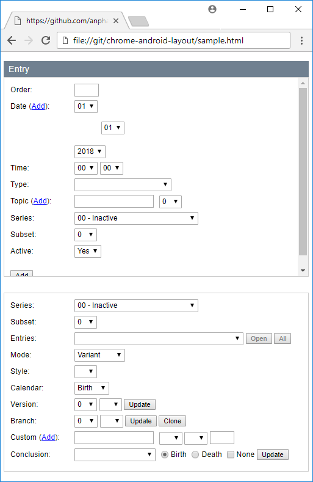

## chrome-mobile-layouts

The program can convert moderately complex HTML pages into XML Constraint layouts for Android. iOS and Xamarin layouts are also to be supported at some point eventually to be hosted inside a Chrome browser plugin. Currently the XML structure can be imported into your Android projects. Supports Grid layout with rowspan and colspan optimizations.

Some modification might be necessary to use these scripts in your webpage. I have only tested it with the latest Chrome.

```xml
<script src="color.js"></script>
<script src="layout_xml.js"></script>
<script>
    document.addEventListener('DOMContentLoaded', () => {
        console.log(parseDocument());
        console.log(writeResourceStringXML());
        console.log(writeResourceArrayXML());
        console.log(writeResourceStyleXML());
        console.log(writeResourceColorXML());
        console.log(writeResourceDrawableXML());
    });
</script>
```



## auto-generated layout xml

```xml
<?xml version="1.0" encoding="utf-8"?>
<LinearLayout
	android:id="@+id/linearlayout1"
	android:layout_marginTop="20dp"
	android:orientation="vertical"
	android:layout_width="wrap_content"
	android:layout_height="match_parent">
	<TextView
		android:id="@+id/textview1"
		style="@style/H2_1"
		android:layout_paddingHorizontal="8dp"
		android:layout_paddingVertical="5dp"
		android:text="@string/entry"
		android:layout_width="match_parent"
		android:layout_height="wrap_content" />
	<ScrollView
		android:id="@+id/scrollview1"
		android:layout_width="match_parent"
		android:layout_height="230dp">
		<LinearLayout
			android:id="@+id/entry"
			android:background="@drawable/form_entry"
			android:layout_paddingHorizontal="10dp"
			android:layout_paddingVertical="10dp"
			android:orientation="vertical"
			android:layout_width="match_parent"
			android:layout_height="match_parent">
			<GridLayout
				android:id="@+id/gridlayout1"
				android:columnCount="2"
				android:layout_width="wrap_content"
				android:layout_height="wrap_content">
				<TextView
					android:id="@+id/textview2"
					style="@style/Label_1"
					android:layout_marginRight="5dp"
					android:layout_paddingTop="3dp"
					android:text="@string/order"
					android:layout_width="100dp"
					android:layout_height="wrap_content" />
				<EditText
					android:id="@+id/order"
					android:background="@drawable/input_order"
					style="@style/Input_1.Input_3"
					android:layout_paddingTop="1dp"
					android:layout_paddingBottom="7dp"
					android:layout_width="40dp"
					android:layout_height="match_parent" />
				<Space android:layout_width="match_parent" android:layout_height="6dp" android:layout_columnSpan="2" />
				<TextView
					android:id="@+id/textview3"
					style="@style/Label_1"
					android:layout_marginRight="5dp"
					android:layout_paddingTop="3dp"
					android:text="@string/date_add"
					android:layout_width="100dp"
					android:layout_height="wrap_content" />
				<LinearLayout
					android:id="@+id/linearlayout2"
					android:layout_paddingBottom="6dp"
					android:orientation="horizontal"
					android:layout_width="wrap_content"
					android:layout_height="match_parent">
					<Spinner
						android:id="@+id/month0"
						android:background="@drawable/select_month0"
						style="@style/Select_1"
						android:layout_paddingTop="1dp"
						android:layout_paddingBottom="2dp"
						android:entries="@array/month0_array"
						android:layout_width="wrap_content"
						android:layout_height="match_parent" />
					<Spinner
						android:id="@+id/day0"
						android:background="@drawable/select_day0"
						style="@style/Select_1"
						android:layout_paddingTop="1dp"
						android:layout_paddingBottom="2dp"
						android:entries="@array/day0_array"
						android:layout_width="wrap_content"
						android:layout_height="match_parent" />
					<Spinner
						android:id="@+id/year0"
						android:background="@drawable/select_year0"
						style="@style/Select_1"
						android:layout_paddingTop="1dp"
						android:layout_paddingBottom="2dp"
						android:entries="@array/year0_array"
						android:layout_width="wrap_content"
						android:layout_height="match_parent" />
				</LinearLayout>
				<Space android:layout_width="match_parent" android:layout_height="6dp" android:layout_columnSpan="2" />
				<TextView
					android:id="@+id/textview4"
					style="@style/Label_1"
					android:layout_marginRight="5dp"
					android:layout_paddingTop="3dp"
					android:text="@string/time"
					android:layout_width="100dp"
					android:layout_height="wrap_content" />
				<ConstraintLayout
					android:id="@+id/hour"
					android:background="@drawable/select_hour"
					android:layout_paddingTop="1dp"
					android:layout_paddingBottom="2dp"
					android:layout_width="wrap_content"
					android:layout_height="match_parent">
					<Spinner
						android:id="@+id/hour"
						android:background="@drawable/select_hour"
						style="@style/Select_1"
						android:layout_paddingTop="1dp"
						android:layout_paddingBottom="2dp"
						android:entries="@array/hour_array"
						android:layout_width="wrap_content"
						android:layout_height="match_parent" />
					<Spinner
						android:id="@+id/minute"
						android:background="@drawable/select_minute"
						style="@style/Select_1"
						android:layout_paddingTop="1dp"
						android:layout_paddingBottom="2dp"
						android:entries="@array/minute_array"
						android:layout_width="wrap_content"
						android:layout_height="match_parent" />
				</ConstraintLayout>
				<TextView
					android:id="@+id/textview5"
					style="@style/Label_1"
					android:layout_marginRight="5dp"
					android:layout_paddingTop="3dp"
					android:text="@string/type"
					android:layout_width="100dp"
					android:layout_height="wrap_content" />
				<Spinner
					android:id="@+id/typeofentry"
					android:background="@drawable/select_typeofentry"
					style="@style/Select_1"
					android:layout_paddingTop="1dp"
					android:layout_paddingBottom="8dp"
					android:entries="@array/typeofentry_array"
					android:layout_width="wrap_content"
					android:layout_height="match_parent" />
				<Space android:layout_width="match_parent" android:layout_height="6dp" android:layout_columnSpan="2" />
				<TextView
					android:id="@+id/textview6"
					style="@style/Label_1"
					android:layout_marginRight="5dp"
					android:layout_paddingTop="3dp"
					android:text="@string/topic_add"
					android:layout_width="100dp"
					android:layout_height="wrap_content" />
				<LinearLayout
					android:id="@+id/linearlayout3"
					android:layout_paddingBottom="6dp"
					android:orientation="horizontal"
					android:layout_width="wrap_content"
					android:layout_height="match_parent">
					<EditText
						android:id="@+id/topic0"
						android:background="@drawable/input_topic0"
						style="@style/Input_1.Input_3"
						android:layout_marginRight="5dp"
						android:layout_paddingVertical="1dp"
						android:layout_width="130dp"
						android:layout_height="match_parent" />
					<Spinner
						android:id="@+id/prominence0"
						android:background="@drawable/select_prominence0"
						style="@style/Select_1"
						android:layout_paddingTop="1dp"
						android:layout_paddingBottom="2dp"
						android:entries="@array/prominence0_array"
						android:layout_width="wrap_content"
						android:layout_height="match_parent" />
				</LinearLayout>
				<Space android:layout_width="match_parent" android:layout_height="6dp" android:layout_columnSpan="2" />
				<TextView
					android:id="@+id/textview7"
					style="@style/Label_1"
					android:layout_marginRight="5dp"
					android:layout_paddingTop="3dp"
					android:text="@string/series"
					android:layout_width="100dp"
					android:layout_height="wrap_content" />
				<Spinner
					android:id="@+id/series"
					android:background="@drawable/select_series"
					style="@style/Select_1"
					android:layout_paddingTop="1dp"
					android:layout_paddingBottom="8dp"
					android:entries="@array/series_array"
					android:layout_width="wrap_content"
					android:layout_height="match_parent" />
				<Space android:layout_width="match_parent" android:layout_height="6dp" android:layout_columnSpan="2" />
				<TextView
					android:id="@+id/textview8"
					style="@style/Label_1"
					android:layout_marginRight="5dp"
					android:layout_paddingTop="3dp"
					android:text="@string/subset"
					android:layout_width="100dp"
					android:layout_height="wrap_content" />
				<Spinner
					android:id="@+id/subset"
					android:background="@drawable/select_subset"
					style="@style/Select_1"
					android:layout_paddingTop="1dp"
					android:layout_paddingBottom="8dp"
					android:entries="@array/subset_array"
					android:layout_width="wrap_content"
					android:layout_height="match_parent" />
				<Space android:layout_width="match_parent" android:layout_height="6dp" android:layout_columnSpan="2" />
				<TextView
					android:id="@+id/textview9"
					style="@style/Label_1"
					android:layout_marginRight="5dp"
					android:layout_paddingTop="3dp"
					android:text="@string/active"
					android:layout_width="100dp"
					android:layout_height="wrap_content" />
				<Spinner
					android:id="@+id/entryactive"
					android:background="@drawable/select_entryactive"
					style="@style/Select_1"
					android:layout_paddingTop="1dp"
					android:layout_paddingBottom="8dp"
					android:entries="@array/entryactive_array"
					android:layout_width="wrap_content"
					android:layout_height="match_parent" />
				<Space android:layout_width="match_parent" android:layout_height="6dp" android:layout_columnSpan="2" />
			</GridLayout>
			<Button
				android:id="@+id/button1"
				android:background="@drawable/input_button1"
				style="@style/Input_1.Input_2"
				android:textSize="12dp"
				android:layout_paddingHorizontal="6dp"
				android:layout_paddingVertical="1dp"
				android:text="@string/add"
				android:layout_width="wrap_content"
				android:layout_height="wrap_content" />
		</LinearLayout>
	</ScrollView>
	<GridLayout
		android:id="@+id/gridlayout2"
		android:columnCount="3"
		android:layout_width="match_parent"
		android:layout_height="wrap_content">
		<TextView
			android:id="@+id/textview10"
			style="@style/Label_1"
			android:layout_marginRight="5dp"
			android:layout_paddingTop="3dp"
			android:text="@string/series"
			android:layout_width="100dp"
			android:layout_height="wrap_content" />
		<Spinner
			android:id="@+id/spinner1"
			android:background="@drawable/select_spinner1"
			style="@style/Select_1"
			android:layout_paddingTop="1dp"
			android:layout_paddingBottom="8dp"
			android:entries="@array/spinner1_array"
			android:layout_columnSpan="2"
			android:layout_width="wrap_content"
			android:layout_height="match_parent" />
		<Space android:layout_width="match_parent" android:layout_height="6dp" android:layout_columnSpan="3" />
		<TextView
			android:id="@+id/textview11"
			style="@style/Label_1"
			android:layout_marginRight="5dp"
			android:layout_paddingTop="3dp"
			android:text="@string/subset"
			android:layout_width="100dp"
			android:layout_height="wrap_content" />
		<Spinner
			android:id="@+id/spinner2"
			android:background="@drawable/select_spinner2"
			style="@style/Select_1"
			android:layout_paddingTop="1dp"
			android:layout_paddingBottom="8dp"
			android:entries="@array/spinner2_array"
			android:layout_columnSpan="2"
			android:layout_width="wrap_content"
			android:layout_height="match_parent" />
		<Space android:layout_width="match_parent" android:layout_height="6dp" android:layout_columnSpan="3" />
		<TextView
			android:id="@+id/textview12"
			style="@style/Label_1"
			android:layout_marginRight="5dp"
			android:layout_paddingTop="3dp"
			android:text="@string/entries"
			android:layout_width="100dp"
			android:layout_height="wrap_content" />
		<ConstraintLayout
			android:id="@+id/spinner3"
			android:background="@drawable/select_spinner3"
			android:layout_paddingTop="1dp"
			android:layout_paddingBottom="2dp"
			android:layout_columnSpan="2"
			android:layout_width="wrap_content"
			android:layout_height="match_parent">
			<Spinner
				android:id="@+id/spinner3"
				android:background="@drawable/select_spinner3"
				style="@style/Select_1"
				android:layout_paddingTop="1dp"
				android:layout_paddingBottom="2dp"
				android:layout_columnSpan="2"
				android:layout_width="wrap_content"
				android:layout_height="match_parent" />
			<Button
				android:id="@+id/button2"
				android:background="@drawable/input_button2"
				style="@style/Input_1.Input_5"
				android:layout_paddingHorizontal="6dp"
				android:layout_paddingVertical="1dp"
				android:text="@string/open"
				android:layout_width="wrap_content"
				android:layout_height="match_parent" />
			<Button
				android:id="@+id/button3"
				android:background="@drawable/input_button3"
				style="@style/Input_1.Input_5"
				android:layout_paddingHorizontal="6dp"
				android:layout_paddingVertical="1dp"
				android:text="@string/all"
				android:layout_width="wrap_content"
				android:layout_height="match_parent" />
		</ConstraintLayout>
		<TextView
			android:id="@+id/textview13"
			style="@style/Label_1"
			android:layout_marginRight="5dp"
			android:layout_paddingTop="3dp"
			android:text="@string/mode"
			android:layout_width="100dp"
			android:layout_height="wrap_content" />
		<Spinner
			android:id="@+id/mode"
			android:background="@drawable/select_mode"
			style="@style/Select_1"
			android:layout_paddingTop="1dp"
			android:layout_paddingBottom="8dp"
			android:entries="@array/mode_array"
			android:layout_columnSpan="2"
			android:layout_width="wrap_content"
			android:layout_height="match_parent" />
		<Space android:layout_width="match_parent" android:layout_height="6dp" android:layout_columnSpan="3" />
		<TextView
			android:id="@+id/textview14"
			style="@style/Label_1"
			android:layout_marginRight="5dp"
			android:layout_paddingTop="3dp"
			android:text="@string/style"
			android:layout_width="100dp"
			android:layout_height="wrap_content" />
		<Spinner
			android:id="@+id/style"
			android:background="@drawable/select_style"
			style="@style/Select_1"
			android:layout_paddingTop="1dp"
			android:layout_paddingBottom="8dp"
			android:entries="@array/style_array"
			android:layout_columnSpan="2"
			android:layout_width="wrap_content"
			android:layout_height="match_parent" />
		<Space android:layout_width="match_parent" android:layout_height="6dp" android:layout_columnSpan="3" />
		<TextView
			android:id="@+id/textview15"
			style="@style/Label_1"
			android:layout_marginRight="5dp"
			android:layout_paddingTop="3dp"
			android:text="@string/calendar"
			android:layout_width="100dp"
			android:layout_height="wrap_content" />
		<Spinner
			android:id="@+id/calendar"
			android:background="@drawable/select_calendar"
			style="@style/Select_1"
			android:layout_paddingTop="1dp"
			android:layout_paddingBottom="8dp"
			android:entries="@array/calendar_array"
			android:layout_columnSpan="2"
			android:layout_width="wrap_content"
			android:layout_height="match_parent" />
		<Space android:layout_width="match_parent" android:layout_height="6dp" android:layout_columnSpan="3" />
		<TextView
			android:id="@+id/textview16"
			style="@style/Label_1"
			android:layout_marginRight="5dp"
			android:layout_paddingTop="3dp"
			android:text="@string/version"
			android:layout_width="100dp"
			android:layout_height="wrap_content" />
		<ConstraintLayout
			android:id="@+id/version"
			android:background="@drawable/select_version"
			android:layout_paddingTop="1dp"
			android:layout_paddingBottom="2dp"
			android:layout_columnSpan="2"
			android:layout_width="wrap_content"
			android:layout_height="match_parent">
			<Spinner
				android:id="@+id/version"
				android:background="@drawable/select_version"
				style="@style/Select_1"
				android:layout_paddingTop="1dp"
				android:layout_paddingBottom="2dp"
				android:entries="@array/version_array"
				android:layout_columnSpan="2"
				android:layout_width="wrap_content"
				android:layout_height="match_parent" />
			<Spinner
				android:id="@+id/version_update"
				android:background="@drawable/select_version_update"
				style="@style/Select_1"
				android:layout_paddingTop="1dp"
				android:layout_paddingBottom="2dp"
				android:entries="@array/version_update_array"
				android:layout_width="wrap_content"
				android:layout_height="match_parent" />
			<Button
				android:id="@+id/button4"
				android:background="@drawable/input_button4"
				style="@style/Input_1.Input_2"
				android:layout_paddingHorizontal="6dp"
				android:layout_paddingVertical="1dp"
				android:text="@string/update"
				android:layout_width="wrap_content"
				android:layout_height="match_parent" />
		</ConstraintLayout>
		<TextView
			android:id="@+id/textview17"
			style="@style/Label_1"
			android:layout_marginRight="5dp"
			android:layout_paddingTop="3dp"
			android:text="@string/branch"
			android:layout_width="100dp"
			android:layout_height="wrap_content" />
		<ConstraintLayout
			android:id="@+id/branch"
			android:background="@drawable/select_branch"
			android:layout_paddingTop="1dp"
			android:layout_paddingBottom="2dp"
			android:layout_columnSpan="2"
			android:layout_width="wrap_content"
			android:layout_height="match_parent">
			<Spinner
				android:id="@+id/branch"
				android:background="@drawable/select_branch"
				style="@style/Select_1"
				android:layout_paddingTop="1dp"
				android:layout_paddingBottom="2dp"
				android:entries="@array/branch_array"
				android:layout_columnSpan="2"
				android:layout_width="wrap_content"
				android:layout_height="match_parent" />
			<Spinner
				android:id="@+id/branch_update"
				android:background="@drawable/select_branch_update"
				style="@style/Select_1"
				android:layout_paddingTop="1dp"
				android:layout_paddingBottom="2dp"
				android:entries="@array/branch_update_array"
				android:layout_width="wrap_content"
				android:layout_height="match_parent" />
			<Button
				android:id="@+id/button5"
				android:background="@drawable/input_button5"
				style="@style/Input_1.Input_2"
				android:layout_paddingHorizontal="6dp"
				android:layout_paddingVertical="1dp"
				android:text="@string/update"
				android:layout_width="wrap_content"
				android:layout_height="match_parent" />
			<Button
				android:id="@+id/button6"
				android:background="@drawable/input_button6"
				style="@style/Input_1.Input_2"
				android:layout_paddingHorizontal="6dp"
				android:layout_paddingVertical="1dp"
				android:text="@string/clone"
				android:layout_width="wrap_content"
				android:layout_height="match_parent" />
		</ConstraintLayout>
		<TextView
			android:id="@+id/textview18"
			style="@style/Label_1"
			android:layout_marginRight="5dp"
			android:layout_paddingTop="3dp"
			android:text="@string/custom_add"
			android:layout_width="100dp"
			android:layout_height="wrap_content" />
		<LinearLayout
			android:id="@+id/linearlayout4"
			android:layout_paddingBottom="6dp"
			android:layout_columnSpan="2"
			android:orientation="horizontal"
			android:layout_width="wrap_content"
			android:layout_height="match_parent">
			<EditText
				android:id="@+id/customname0"
				android:background="@drawable/input_customname0"
				style="@style/Input_1.Input_3"
				android:layout_marginRight="5dp"
				android:layout_paddingVertical="1dp"
				android:layout_width="130dp"
				android:layout_height="match_parent" />
			<Spinner
				android:id="@+id/custommonth0"
				android:background="@drawable/select_custommonth0"
				style="@style/Select_1"
				android:layout_paddingTop="1dp"
				android:layout_paddingBottom="2dp"
				android:entries="@array/custommonth0_array"
				android:layout_width="wrap_content"
				android:layout_height="match_parent" />
			<Spinner
				android:id="@+id/customday0"
				android:background="@drawable/select_customday0"
				style="@style/Select_1"
				android:layout_paddingTop="1dp"
				android:layout_paddingBottom="2dp"
				android:entries="@array/customday0_array"
				android:layout_width="wrap_content"
				android:layout_height="match_parent" />
			<EditText
				android:id="@+id/customyear0"
				android:background="@drawable/input_customyear0"
				style="@style/Input_1.Input_3"
				android:layout_paddingVertical="1dp"
				android:layout_width="40dp"
				android:layout_height="match_parent" />
		</LinearLayout>
		<Space android:layout_width="match_parent" android:layout_height="6dp" android:layout_columnSpan="3" />
		<TextView
			android:id="@+id/textview19"
			style="@style/Label_1"
			android:layout_marginRight="5dp"
			android:layout_paddingTop="3dp"
			android:text="@string/conclusion"
			android:layout_width="100dp"
			android:layout_height="wrap_content" />
		<ConstraintLayout
			android:id="@+id/person"
			android:background="@drawable/select_person"
			android:layout_paddingTop="1dp"
			android:layout_paddingBottom="2dp"
			android:layout_width="wrap_content"
			android:layout_height="match_parent">
			<Spinner
				android:id="@+id/person"
				android:background="@drawable/select_person"
				style="@style/Select_1"
				android:layout_paddingTop="1dp"
				android:layout_paddingBottom="2dp"
				android:entries="@array/person_array"
				android:layout_width="wrap_content"
				android:layout_height="match_parent" />
			<RadioGroup
				android:id="@+id/radiogroup1"
				android:checkedButton="@id+/c2">
				<RadioButton
					android:id="@+id/c2"
					style="@style/Input_1.Input_4"
					android:layout_marginTop="3dp"
					android:layout_marginRight="3dp"
					android:layout_marginLeft="5dp"
					android:layout_width="wrap_content"
					android:layout_height="match_parent"
					android:text="@string/birth" />
				<RadioButton
					android:id="@+id/c3"
					style="@style/Input_1.Input_4"
					android:layout_marginTop="3dp"
					android:layout_marginRight="3dp"
					android:layout_marginLeft="5dp"
					android:layout_width="wrap_content"
					android:layout_height="match_parent"
					android:text="@string/death" />
			</RadioGroup>
			<CheckBox
				android:id="@+id/c4"
				style="@style/Input_1.Input_4"
				android:layout_marginRight="3dp"
				android:layout_marginLeft="4dp"
				android:layout_marginVertical="3dp"
				android:layout_width="wrap_content"
				android:layout_height="match_parent"
				android:text="@string/none" />
		</ConstraintLayout>
		<Button
			android:id="@+id/button7"
			android:background="@drawable/input_button7"
			style="@style/Input_1.Input_2"
			android:layout_paddingTop="1dp"
			android:layout_paddingBottom="7dp"
			android:layout_paddingHorizontal="6dp"
			android:text="@string/update"
			android:layout_width="wrap_content"
			android:layout_height="match_parent" />
		<Space android:layout_width="match_parent" android:layout_height="6dp" android:layout_columnSpan="3" />
	</GridLayout>
</LinearLayout>
```

## auto-generated string resources

Partial output of the string resources.

```xml
<?xml version="1.0" encoding="utf-8"?>
<resources>
	<string name="active">Active:</string>
	<string name="add">Add</string>
	<string name="all">All</string>
	<string name="birth">Birth</string>
	<string name="branch">Branch:</string>
	<string name="calendar">Calendar:</string>
	<string name="clone">Clone</string>
	<string name="conclusion">Conclusion:</string>
	<string name="custom_add">Custom (<a href="#">Add</a>):</string>
	<string name="date_add">Date (<a href="#">Add</a>):</string>
	<string name="death">Death</string>
	<string name="entries">Entries:</string>
	<string name="entry">Entry</string>
	<string name="mode">Mode:</string>
	<string name="next">Next</string>
	<string name="no">No</string>
	<string name="none">None</string>
	<string name="open">Open</string>
	<string name="order">Order:</string>
	<string name="predefined">Predefined</string>
	<string name="series">Series:</string>
	<string name="style">Style:</string>
	<string name="subset">Subset:</string>
	<string name="time">Time:</string>
	<string name="topic_add">Topic (<a href="#">Add</a>):</string>
	<string name="type">Type:</string>
	<string name="update">Update</string>
	<string name="variant">Variant</string>
	<string name="version">Version:</string>
	<string name="yes">Yes</string>
</resources>
```

```xml
<?xml version="1.0" encoding="utf-8"?>
<resources>
	<array name="branch_array">
		<item>0</item>
		<item>1</item>
		<item>2</item>
		<item>3</item>
		<item>4</item>
		<item>5</item>
		<item>6</item>
		<item>7</item>
		<item>8</item>
		<item>9</item>
		<item>10</item>
	</array>
	<array name="branch_update_array">
		<item>0</item>
		<item>1</item>
		<item>2</item>
		<item>3</item>
		<item>4</item>
		<item>5</item>
		<item>6</item>
		<item>7</item>
		<item>8</item>
		<item>9</item>
		<item>10</item>
		<item>11</item>
		<item>12</item>
		<item>13</item>
	</array>
	<array name="calendar_array">
		<item name="1">@string/birth</item>
		<item name="2">@string/death</item>
	</array>
	<array name="entryactive_array">
		<item name="1">@string/yes</item>
		<item name="0">@string/no</item>
	</array>
	<array name="mode_array">
		<item name="1">@string/variant</item>
		<item name="2">@string/predefined</item>
	</array>
	<array name="prominence0_array">
		<item>0</item>
		<item>1</item>
	</array>
	<array name="year0_array">
		<item>2001</item>
		<item>2002</item>
		<item>2003</item>
		<item>2004</item>
		<item>2005</item>
		<item>2006</item>
		<item>2007</item>
		<item>2008</item>
		<item>2009</item>
		<item>2010</item>
		<item>2011</item>
		<item>2012</item>
		<item>2013</item>
		<item>2014</item>
		<item>2015</item>
		<item>2016</item>
		<item>2017</item>
		<item>2018</item>
	</array>
</resources>
```

## auto-generated styles and themes

Styles are grouped by HTML element name and then by common properties.  These styles were modified to demonstrate the grouping capabilities although it is not completely accurate with the sample picture.

```xml
<?xml version="1.0" encoding="utf-8"?>
<resources>
	<style name="H2_1">
		<item name="android:fontFamily">Arial, Helvetica, Tahoma</item>
		<item name="android:textSize">14dp</item>
		<item name="android:fontWeight">400</item>
		<item name="android:textStyle">normal</item>
		<item name="android:textColor">@color/white</item>
		<item name="android:background">@color/slate_gray</item>
	<style>
	<style name="A_1">
		<item name="android:fontFamily">Arial, Helvetica, Tahoma</item>
		<item name="android:textSize">12dp</item>
		<item name="android:fontWeight">400</item>
		<item name="android:textStyle">normal</item>
		<item name="android:textColor">@color/blue</item>
	<style>
	<style name="Input_1">
		<item name="android:fontFamily">Arial</item>
	<style>
	<style name="Input_2">
		<item name="android:fontWeight">400</item>
		<item name="android:textColor">@color/black</item>
		<item name="android:textSize">13dp</item>
		<item name="android:textStyle">normal</item>
	<style>
	<style name="Input_3">
		<item name="android:background">@color/white_smoke1</item>
		<item name="android:fontWeight">400</item>
		<item name="android:textSize">11dp</item>
		<item name="android:textStyle">normal</item>
	<style>
	<style name="Input_4">
		<item name="android:background">@color/white</item>
		<item name="android:textSize">13dp</item>
	<style>
	<style name="Input_5">
		<item name="android:textColor">@color/black</item>
		<item name="android:textSize">11dp</item>
	<style>
	<style name="Input_6">
		<item name="android:background">@color/white_smoke1</item>
		<item name="android:fontWeight">400</item>
		<item name="android:textColor">@color/black</item>
		<item name="android:textSize">12dp</item>
		<item name="android:textStyle">normal</item>
	<style>
	<style name="Input_7">
		<item name="android:textColor">@color/gray</item>
		<item name="android:textSize">11dp</item>
	<style>
	<style name="Label_1">
		<item name="android:fontFamily">Arial, Helvetica, Tahoma</item>
		<item name="android:textSize">12dp</item>
		<item name="android:fontWeight">400</item>
		<item name="android:textStyle">normal</item>
		<item name="android:textColor">@color/black</item>
	<style>
	<style name="Select_1">
		<item name="android:fontFamily">Arial</item>
		<item name="android:textSize">12dp</item>
		<item name="android:fontWeight">400</item>
		<item name="android:textStyle">normal</item>
		<item name="android:textColor">@color/black</item>
		<item name="android:background">@color/white</item>
	<style>
</resources>
<!-- filename: res/values/styles.xml -->
```

## auto-generated color resources

Color names from the X11 and CSS3 specification are used to choose the nearest color for these color resources.

```xml
<?xml version="1.0" encoding="utf-8"?>
<resources>
	<color name="#000000">black</color>
	<color name="#708090">slate_gray</color>
	<color name="#808080">gray</color>
	<color name="#A9A9A9">dark_gray</color>
	<color name="#CCCCCC">light_gray1</color>
	<color name="#DDDDDD">white_smoke1</color>
	<color name="#FFFFFF">white</color>
</resources>
<!-- filename: res/values/colors.xml -->
```

## auto-generated drawable resources

Partial output of the drawable resources.

```xml
<?xml version="1.0" encoding="utf-8"?>
<layer-list xmlns:android="http://schemas.android.com/apk/res/android">
	<item>
		<shape android:shape="rectangle">
			<solid android:color="@color/white" />
		</shape>
	</item>
	<item>
		<shape android:shape="rectangle">
			<stroke android:width="2dp" android:color="@color/black" />
		</shape>
	</item>
</layer-list>
<!-- filename: res/drawable/input_order.xml -->
```

```xml
<?xml version="1.0" encoding="utf-8"?>
<layer-list xmlns:android="http://schemas.android.com/apk/res/android">
	<item>
		<shape android:shape="rectangle">
			<solid android:color="@color/white" />
		</shape>
	</item>
	<item>
		<shape android:shape="rectangle">
			<stroke android:width="1dp" android:color="@color/dark_gray" />
		</shape>
	</item>
</layer-list>
<!-- filename: res/drawable/select_hour.xml -->
```

## user written html

The DIV and FORM tag are not required for mobile devices which sometimes causes additional Linear layouts to be auto-generated.  Most of the android attributes were auto-generated from CSS and were not included with the sample HTML.

```xml
<html>
<head></head>
<body>
<div>
    <h2>Entry</h2>
    <form name="entry" autocomplete="off">
        <ul>
            <li>
                <label>Order:</label>
                <input type="text" name="order" class="null-allowed" />
            </li>
            <li>
                <label>Date (<a href="javascript://">Add</a>):</label>
                <div class="entry-date">
                    <select name="month0"></select>
                    <select name="day0"></select>
                    <select name="year0"></select>
                </div>
            </li>
            <li>
                <label>Time:</label>
                <select name="hour" class="null-allowed"></select>
                <select name="minute"></select>
            </li>
            <li>
                <label>Type:</label>
                <select name="typeofentry"></select>
            </li>
            <li>
                <label>Topic (<a href="javascript://">Add</a>):</label>
                <div class="entry-topic">
                    <input type="text" name="topic0" />
                    <select name="prominence0"></select>
                </div>
            </li>
            <li>
                <label>Series:</label>
                <select name="series"></select>
            </li>
            <li>
                <label>Subset:</label>
                <select name="subset"></select>
            </li>
            <li>
                <label>Active:</label>
                <select name="entryactive"></select>
            </li>
        </ul>
        <br />
        <input type="button" value="Add" />
    </form>
    <br />
    <br />
    <form name="itemofentry" action="/admin/itemofentry" method="post" autocomplete="off">
        <ul>
            <li>
                <label>Series:</label>
                <select name="series" class="req-pageurl-4"></select>
            </li>
            <li>
                <label>Subset:</label>
                <select name="subset" class="req-pageurl-5"></select>
            </li>
            <li>
                <label>Entries:</label>
                <select name="entry" class="req-pageurl-0"></select>
                <input type="button" value="Open" disabled="disabled" target="_blank" />
                <input type="button" value="All" disabled="disabled" target="_blank" />
            </li>
            <li>
                <label>Mode:</label>
                <select name="mode" class="req-pageurl-1"></select>
            </li>
            <li>
                <label>Style:</label>
                <select name="style" class="req-pageurl-2"></select>
            </li>
            <li>
                <label>Calendar:</label>
                <select name="calendar" class="req-pageurl-3"></select>
            </li>
            <li>
                <label>Version:</label>
                <select name="version" class="req-pageurl-6"></select>
                <select name="version_update" class="null-allowed"></select>
                <input type="button" value="Update" />
            </li>
            <li>
                <label>Branch:</label>
                <select name="branch" class="req-pageurl-7"></select>
                <select name="branch_update" class="null-allowed"></select>
                <input type="button" value="Update" />
                <input type="button" value="Clone" />
            </li>
            <li>
                <label>Custom (<a href="javascript://">Add</a>):</label>
                <div class="entry-custom">
                    <input type="text" name="customname0" class="null-allowed" />
                    <select name="custommonth0" class="null-allowed"></select>
                    <select name="customday0" class="null-allowed"></select>
                    <input type="text" name="customyear0" class="null-allowed" />
                </div>
            </li>
            <li>
                <label>Conclusion:</label>
                <select name="person" class="null-allowed"></select>
                <div>
                    <input id="c2" type="radio" name="personbirth" value="1" checked="checked" />
                    <label for="c2">Birth</label>
                    <input id="c3" type="radio" name="personbirth" value="0" />
                    <label for="c3">Death</label>
                    <input id="c4" type="checkbox" name="conclusionnone" value="1" />
                    <label for="c4">None</label>
                </div>
                <input type="button" value="Update" />
            </li>
        </ul>
    </form>
</div>
</body>
</html>
```