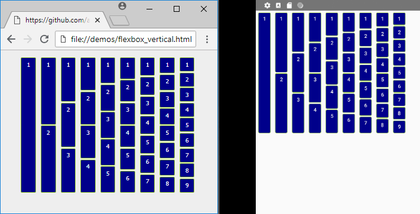
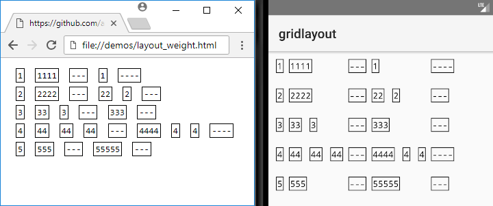

## androme

This program can convert moderately complex HTML pages into the standard XML layouts for Android. iOS and Xamarin Forms can also be supported once the Android version is stable. HTML is the most popular and versatile way to design user interfaces and can be used to generate the UI for any platform based on XML. Currently the generated XML can be imported into your Android projects as a foundation for your layout design.

Multiple views per page are supported similiar to iOS Storyboards with their resources and styles merged into one package to simplify maintenance. Conceptually creating a snapshot history in XML of what is displayed in the browser.

## INSTALLATION (global js variable: androme)

*** External CSS files cannot be parsed when loading HTML pages using the file:// protocol (hard drive) with Chrome 64 or higher. Loading the HTML document from a web server (http://localhost) or embedding the CSS files into a &lt;style&gt; tag can get you past this security restriction. You can also try using a different browser (FireFox/Safari/Edge). Chrome is the preferred browser when generating the production version of your program. ***

Express server through Node.js is available with a provided default configuration. It is sufficient to load this program locally and can also be used for development. Using Express is highly recommended as you can create a ZIP archive of the generated resources from inside your browser which can be conveniently extracted into your project folder. Installing these dependencies are only required if you plan on using Express as your local web server.

* Install Node.js: http://www.nodejs.com

* Install androme: (choose one)
  1. git clone https://github.com/anpham6/androme
  2. npm i androme

* Change directory: (choose one)
  1. cd androme
  2. cd node_modules/androme

* Install dependencies: (choose one)
  1. npm install && npm run prod
  2. npm install

* Load web server:
  1. node app.js

* Open Chrome: http://localhost:3000/demos/form.html

If you install via NPM then it is recommended you put androme into its own separate folder rather than hosting it inside "node_modules".

Library files are in the /dist folder. There is a babel minified for production (ES5) and non-babel version for development (ES6). The primary function "parseDocument" can be called on multiple elements and multiple times per session. The application will continuously and progressively build into a single entity with combined shared resources.

```javascript
<script src="/dist/androme.js"></script>
<script>
    androme.settings.targetAPI = 19; // androme.build.KITKAT
    androme.settings.density = 160; // androme.density.MDPI

    // without Express: use either console.log() or element.innerHTML to display using "write" commands

    document.addEventListener('DOMContentLoaded', () => {
        // required: zero or more
        androme.parseDocument(/* document.getElementById('mainview') */, /* 'subview' */, /* etc... */);
        androme.close();
        androme.saveAllToDisk(); /* Express required */

        // optional
        androme.writeLayoutAllXml(true); /* true: save to disk, false: string xml */
        androme.writeResourceAllXml(true);

        // individual
        androme.writeResourceDrawableXml(true);
        androme.writeResourceStyleXml(true);
        androme.writeResourceColorXml(true);
        androme.writeResourceFontXml(true);
        androme.writeResourceArrayXml(true);
        androme.writeResourceStringXml(true);

        // start new "parseDocument" session
        androme.reset();
    });
</script>
```
These settings are available in the global variable "androme" to customize your desired XML structure. Compatible attributes are generated based on the targetAPI setting. I have not validated every attribute in relation to the API version but the customization code can easily be modified to support your project.

```javascript
androme.settings = {
    targetAPI: androme.build.OREO,
    density: androme.density.MDPI,
    showAttributes: true,
    horizontalPerspective: true,
    useConstraintLayout: true,
    useConstraintChain: true,
    useConstraintGuideline: true,
    useGridLayout: true,
    useLayoutWeight: true,
    useUnitDP: true,
    useFontAlias: false,
    supportRTL: true,
    numberResourceValue: false,
    alwaysReevaluateResources: false,
    excludeTextColor: ['#000000'],
    excludeBackgroundColor: ['#FFFFFF'],
    whitespaceHorizontalOffset: 4,
    whitespaceVerticalOffset: 14,
    chainPackedHorizontalOffset: 4,
	chainPackedVerticalOffset: 14,
    autoCloseOnWrite: true,
    outputDirectory: 'app/src/main',
    outputArchiveFileType: 'zip', // zip | tar
    outputMaxProcessingTime: 30,
    outputActivityMainFileName: 'activity_main.xml'
};
```
You can preview the library with the provided /demos/*.html which should generate the same XML you see here in the README. Using the latest Chrome will always generate the most accurate layout.

Constraint chain is available as a setting since flexbox does not always support exact placement for views that are not in the typical grid format. The same can be said for disabling GridLayout in favor of LinearLayout when the generated UI is not accurate. ConstraintLayout and RelativeLayout should render the same UI although ConstraintLayout is preferred for most scenarios. To use Constraint circle for placement you have to disable "useConstraintGuideline".

Most layout issues are probably due to layout_width and layout_height not being set correctly. Changing wrap_content to match_parent and vice versa or setting the actual width and height will fix most problems. HTML has a very flexible layout system built for very wide screens which makes it difficult sometimes to convert them for mobile devices. Most people prefer not to use tables in HTML although for mobile devices it will generate a very efficient GridLayout with androme and probably will perform faster than ConstraintLayout.


Flexbox layouts using Constraint chains are mostly supported within the limitations of the Android API. Doing things from the "left" perspective is preferred and to use single row flexbox layouts instead of floating "right". There is support for basic floating and there are plans to support most of the common floating techniques.








### auto-generated layout

```xml
<?xml version="1.0" encoding="utf-8"?>
<LinearLayout
	xmlns:android="http://schemas.android.com/apk/res/android"
	xmlns:app="http://schemas.android.com/apk/res-auto"
	android:id="@+id/androme-root"
	android:gravity="top"
	android:layout_height="wrap_content"
	android:layout_width="550dp"
	android:orientation="vertical">
	<TextView
		android:id="@+id/textview_1"
		android:background="@color/slate_gray"
		android:layout_height="wrap_content"
		android:layout_width="match_parent"
		android:padding="8dp"
		android:text="@string/entry"
		style="@style/H2_1" />
	<LinearLayout
		android:id="@+id/entry"
		android:background="@drawable/form_entry"
		android:layout_height="wrap_content"
		android:layout_width="match_parent"
		android:orientation="vertical"
		android:paddingHorizontal="10dp"
		android:paddingVertical="5dp">
		<GridLayout
			android:id="@+id/gridlayout_1"
			android:columnCount="2"
			android:layout_height="wrap_content"
			android:layout_width="match_parent"
			android:paddingBottom="11dp"
			android:paddingHorizontal="5dp"
			android:paddingTop="5dp">
			<TextView
				android:id="@+id/textview_2"
				android:labelFor="@+id/order"
				android:layout_height="wrap_content"
				android:layout_marginEnd="5dp"
				android:layout_width="100dp"
				android:paddingTop="3dp"
				android:text="@string/order"
				style="@style/Label_2" />
			<EditText
				android:id="@+id/order"
				android:background="@drawable/input_order"
				android:focusable="true"
				android:inputType="text"
				android:layout_height="wrap_content"
				android:layout_width="40dp"
				android:paddingVertical="1dp"
				style="@style/Input_2" />
			<Space
				android:id="@+id/space_1"
				android:layout_columnSpan="2"
				android:layout_height="6dp"
				android:layout_width="match_parent" />
			<TextView
				android:id="@+id/textview_3"
				android:layout_height="wrap_content"
				android:layout_marginEnd="5dp"
				android:layout_width="100dp"
				android:paddingTop="3dp"
				android:text="@string/date_add"
				style="@style/Label_1" />
			<android.support.constraint.ConstraintLayout
				android:id="@+id/constraintlayout_1"
				android:layout_height="wrap_content"
				android:layout_width="wrap_content">
				<Spinner
					android:id="@+id/month0"
					android:background="@drawable/select_hour"
					android:entries="@array/month0_array"
					android:focusable="true"
					android:layout_height="wrap_content"
					android:layout_width="wrap_content"
					android:paddingBottom="2dp"
					android:paddingTop="1dp"
					app:layout_constraintEnd_toStartOf="@+id/day0"
					app:layout_constraintHorizontal_bias="0"
					app:layout_constraintHorizontal_chainStyle="packed"
					app:layout_constraintStart_toStartOf="parent"
					app:layout_constraintTop_toTopOf="parent"
					app:layout_constraintWidth_min="37dp"
					style="@style/Select_1" />
				<Spinner
					android:id="@+id/day0"
					android:background="@drawable/select_hour"
					android:entries="@array/day0_array"
					android:focusable="true"
					android:layout_height="wrap_content"
					android:layout_marginStart="4dp"
					android:layout_width="wrap_content"
					android:paddingBottom="2dp"
					android:paddingTop="1dp"
					app:layout_constraintEnd_toStartOf="@+id/year0"
					app:layout_constraintStart_toEndOf="@+id/month0"
					app:layout_constraintTop_toTopOf="parent"
					app:layout_constraintWidth_min="37dp"
					style="@style/Select_1" />
				<Spinner
					android:id="@+id/year0"
					android:background="@drawable/select_hour"
					android:entries="@array/year0_array"
					android:focusable="true"
					android:layout_height="wrap_content"
					android:layout_marginStart="4dp"
					android:layout_width="wrap_content"
					android:paddingBottom="2dp"
					android:paddingTop="1dp"
					app:layout_constraintEnd_toEndOf="parent"
					app:layout_constraintStart_toEndOf="@+id/day0"
					app:layout_constraintTop_toTopOf="parent"
					app:layout_constraintWidth_min="37dp"
					style="@style/Select_1" />
				<Spinner
					android:id="@+id/month1"
					android:background="@drawable/select_hour"
					android:entries="@array/month1_array"
					android:focusable="true"
					android:layout_height="wrap_content"
					android:layout_marginTop="12dp"
					android:layout_width="wrap_content"
					android:paddingBottom="2dp"
					android:paddingTop="1dp"
					app:layout_constraintEnd_toStartOf="@+id/day1"
					app:layout_constraintHorizontal_bias="0"
					app:layout_constraintHorizontal_chainStyle="packed"
					app:layout_constraintStart_toStartOf="parent"
					app:layout_constraintTop_toBottomOf="@+id/month0"
					app:layout_constraintWidth_min="37dp"
					style="@style/Select_1" />
				<Spinner
					android:id="@+id/day1"
					android:background="@drawable/select_hour"
					android:entries="@array/day1_array"
					android:focusable="true"
					android:layout_height="wrap_content"
					android:layout_marginStart="4dp"
					android:layout_marginTop="12dp"
					android:layout_width="wrap_content"
					android:paddingBottom="2dp"
					android:paddingTop="1dp"
					app:layout_constraintEnd_toStartOf="@+id/year1"
					app:layout_constraintStart_toEndOf="@+id/month1"
					app:layout_constraintTop_toBottomOf="@+id/month0"
					app:layout_constraintWidth_min="37dp"
					style="@style/Select_1" />
				<Spinner
					android:id="@+id/year1"
					android:background="@drawable/select_hour"
					android:entries="@array/year1_array"
					android:focusable="true"
					android:layout_height="wrap_content"
					android:layout_marginStart="4dp"
					android:layout_marginTop="12dp"
					android:layout_width="wrap_content"
					android:paddingBottom="2dp"
					android:paddingTop="1dp"
					app:layout_constraintEnd_toEndOf="parent"
					app:layout_constraintStart_toEndOf="@+id/day1"
					app:layout_constraintTop_toBottomOf="@+id/month0"
					app:layout_constraintWidth_min="37dp"
					style="@style/Select_1" />
				<Spinner
					android:id="@+id/month2"
					android:background="@drawable/select_hour"
					android:entries="@array/month2_array"
					android:focusable="true"
					android:layout_height="wrap_content"
					android:layout_marginTop="12dp"
					android:layout_width="wrap_content"
					android:paddingBottom="2dp"
					android:paddingTop="1dp"
					app:layout_constraintBottom_toBottomOf="parent"
					app:layout_constraintEnd_toStartOf="@+id/day2"
					app:layout_constraintHorizontal_bias="0"
					app:layout_constraintHorizontal_chainStyle="packed"
					app:layout_constraintStart_toStartOf="parent"
					app:layout_constraintTop_toBottomOf="@+id/month1"
					app:layout_constraintWidth_min="37dp"
					style="@style/Select_1" />
				<Spinner
					android:id="@+id/day2"
					android:background="@drawable/select_hour"
					android:entries="@array/day2_array"
					android:focusable="true"
					android:layout_height="wrap_content"
					android:layout_marginStart="4dp"
					android:layout_marginTop="12dp"
					android:layout_width="wrap_content"
					android:paddingBottom="2dp"
					android:paddingTop="1dp"
					app:layout_constraintBottom_toBottomOf="parent"
					app:layout_constraintEnd_toStartOf="@+id/year2"
					app:layout_constraintStart_toEndOf="@+id/month2"
					app:layout_constraintTop_toBottomOf="@+id/month1"
					app:layout_constraintWidth_min="37dp"
					style="@style/Select_1" />
				<Spinner
					android:id="@+id/year2"
					android:background="@drawable/select_hour"
					android:entries="@array/year2_array"
					android:focusable="true"
					android:layout_height="wrap_content"
					android:layout_marginStart="4dp"
					android:layout_marginTop="12dp"
					android:layout_width="wrap_content"
					android:paddingBottom="2dp"
					android:paddingTop="1dp"
					app:layout_constraintBottom_toBottomOf="parent"
					app:layout_constraintEnd_toEndOf="parent"
					app:layout_constraintStart_toEndOf="@+id/day2"
					app:layout_constraintTop_toBottomOf="@+id/month1"
					app:layout_constraintWidth_min="37dp"
					style="@style/Select_1" />
			</android.support.constraint.ConstraintLayout>
			<Space
				android:id="@+id/space_2"
				android:layout_columnSpan="2"
				android:layout_height="6dp"
				android:layout_width="match_parent" />
			<TextView
				android:id="@+id/textview_4"
				android:layout_height="wrap_content"
				android:layout_marginEnd="5dp"
				android:layout_width="100dp"
				android:paddingTop="3dp"
				android:text="@string/time"
				style="@style/Label_1" />
			<LinearLayout
				android:id="@+id/linearlayout_1"
				android:layout_height="wrap_content"
				android:layout_width="wrap_content"
				android:orientation="horizontal">
				<Spinner
					android:id="@+id/hour"
					android:background="@drawable/select_hour"
					android:entries="@array/hour_array"
					android:focusable="true"
					android:layout_height="wrap_content"
					android:layout_width="wrap_content"
					android:minWidth="37dp"
					android:paddingBottom="2dp"
					android:paddingTop="1dp"
					style="@style/Select_1" />
				<Spinner
					android:id="@+id/minute"
					android:background="@drawable/select_hour"
					android:entries="@array/minute_array"
					android:focusable="true"
					android:layout_height="wrap_content"
					android:layout_marginStart="4dp"
					android:layout_width="wrap_content"
					android:minWidth="37dp"
					android:paddingBottom="2dp"
					android:paddingTop="1dp"
					style="@style/Select_1" />
			</LinearLayout>
			<Space
				android:id="@+id/space_3"
				android:layout_columnSpan="2"
				android:layout_height="6dp"
				android:layout_width="match_parent" />
			<TextView
				android:id="@+id/textview_5"
				android:layout_height="wrap_content"
				android:layout_marginEnd="5dp"
				android:layout_width="100dp"
				android:paddingTop="3dp"
				android:text="@string/type"
				style="@style/Label_1" />
			<Spinner
				android:id="@+id/typeofentry"
				android:background="@drawable/select_hour"
				android:entries="@array/typeofentry_array"
				android:focusable="true"
				android:layout_height="wrap_content"
				android:layout_width="160dp"
				android:minWidth="37dp"
				android:paddingBottom="2dp"
				android:paddingTop="1dp"
				style="@style/Select_1" />
			<Space
				android:id="@+id/space_4"
				android:layout_columnSpan="2"
				android:layout_height="6dp"
				android:layout_width="match_parent" />
			<TextView
				android:id="@+id/textview_6"
				android:labelFor="@+id/topic0"
				android:layout_height="wrap_content"
				android:layout_marginEnd="5dp"
				android:layout_width="100dp"
				android:paddingTop="3dp"
				android:text="@string/topic_add"
				style="@style/Label_1" />
			<LinearLayout
				android:id="@+id/linearlayout_2"
				android:layout_height="wrap_content"
				android:layout_width="wrap_content"
				android:orientation="horizontal">
				<EditText
					android:id="@+id/topic0"
					android:background="@drawable/input_order"
					android:focusable="true"
					android:inputType="text"
					android:layout_height="wrap_content"
					android:layout_marginEnd="5dp"
					android:layout_width="130dp"
					android:paddingVertical="1dp"
					style="@style/Input_2" />
				<Spinner
					android:id="@+id/prominence0"
					android:background="@drawable/select_hour"
					android:entries="@array/prominence0_array"
					android:focusable="true"
					android:layout_height="wrap_content"
					android:layout_marginStart="4dp"
					android:layout_width="wrap_content"
					android:minWidth="37dp"
					android:paddingBottom="2dp"
					android:paddingTop="1dp"
					style="@style/Select_1" />
			</LinearLayout>
			<Space
				android:id="@+id/space_5"
				android:layout_columnSpan="2"
				android:layout_height="6dp"
				android:layout_width="match_parent" />
			<TextView
				android:id="@+id/textview_7"
				android:layout_height="wrap_content"
				android:layout_marginEnd="5dp"
				android:layout_width="100dp"
				android:paddingTop="3dp"
				android:text="@string/series"
				style="@style/Label_1" />
			<Spinner
				android:id="@+id/series"
				android:background="@drawable/select_hour"
				android:entries="@array/series_array"
				android:focusable="true"
				android:layout_height="wrap_content"
				android:layout_width="200dp"
				android:minWidth="37dp"
				android:paddingBottom="2dp"
				android:paddingTop="1dp"
				style="@style/Select_1" />
			<Space
				android:id="@+id/space_6"
				android:layout_columnSpan="2"
				android:layout_height="6dp"
				android:layout_width="match_parent" />
			<TextView
				android:id="@+id/textview_8"
				android:layout_height="wrap_content"
				android:layout_marginEnd="5dp"
				android:layout_width="100dp"
				android:paddingTop="3dp"
				android:text="@string/subset"
				style="@style/Label_1" />
			<Spinner
				android:id="@+id/subset"
				android:background="@drawable/select_hour"
				android:entries="@array/subset_array"
				android:focusable="true"
				android:layout_height="wrap_content"
				android:layout_width="wrap_content"
				android:minWidth="37dp"
				android:paddingBottom="2dp"
				android:paddingTop="1dp"
				style="@style/Select_1" />
			<Space
				android:id="@+id/space_7"
				android:layout_columnSpan="2"
				android:layout_height="6dp"
				android:layout_width="match_parent" />
			<TextView
				android:id="@+id/textview_9"
				android:layout_height="wrap_content"
				android:layout_marginEnd="5dp"
				android:layout_width="100dp"
				android:paddingTop="3dp"
				android:text="@string/active"
				style="@style/Label_1" />
			<Spinner
				android:id="@+id/entryactive"
				android:background="@drawable/select_hour"
				android:entries="@array/entryactive_array"
				android:focusable="true"
				android:layout_height="wrap_content"
				android:layout_width="wrap_content"
				android:minWidth="37dp"
				android:paddingBottom="2dp"
				android:paddingTop="1dp"
				style="@style/Select_1" />
		</GridLayout>
		<View
			android:id="@+id/view_1"
			android:background="@color/light_gray_1"
			android:layout_height="1dp"
			android:layout_margin="10dp"
			android:layout_width="match_parent" />
		<GridLayout
			android:id="@+id/gridlayout_2"
			android:columnCount="2"
			android:layout_height="wrap_content"
			android:layout_width="match_parent"
			android:paddingBottom="11dp"
			android:paddingHorizontal="5dp"
			android:paddingTop="5dp">
			<TextView
				android:id="@+id/textview_10"
				android:layout_height="wrap_content"
				android:layout_marginEnd="5dp"
				android:layout_width="100dp"
				android:paddingTop="3dp"
				android:text="@string/series"
				style="@style/Label_2" />
			<Spinner
				android:id="@+id/series_1"
				android:background="@drawable/select_hour"
				android:entries="@array/series_1_array"
				android:focusable="true"
				android:layout_height="wrap_content"
				android:layout_width="200dp"
				android:minWidth="37dp"
				android:paddingBottom="2dp"
				android:paddingTop="1dp"
				style="@style/Select_1" />
			<Space
				android:id="@+id/space_8"
				android:layout_columnSpan="2"
				android:layout_height="6dp"
				android:layout_width="match_parent" />
			<TextView
				android:id="@+id/textview_11"
				android:layout_height="wrap_content"
				android:layout_marginEnd="5dp"
				android:layout_width="100dp"
				android:paddingTop="3dp"
				android:text="@string/subset"
				style="@style/Label_1" />
			<Spinner
				android:id="@+id/subset_1"
				android:background="@drawable/select_hour"
				android:entries="@array/subset_1_array"
				android:focusable="true"
				android:layout_height="wrap_content"
				android:layout_width="wrap_content"
				android:minWidth="37dp"
				android:paddingBottom="2dp"
				android:paddingTop="1dp"
				style="@style/Select_1" />
			<Space
				android:id="@+id/space_9"
				android:layout_columnSpan="2"
				android:layout_height="6dp"
				android:layout_width="match_parent" />
			<TextView
				android:id="@+id/textview_12"
				android:layout_height="wrap_content"
				android:layout_marginEnd="5dp"
				android:layout_width="100dp"
				android:paddingTop="3dp"
				android:text="@string/entries"
				style="@style/Label_1" />
			<LinearLayout
				android:id="@+id/linearlayout_3"
				android:layout_height="wrap_content"
				android:layout_width="wrap_content"
				android:orientation="horizontal">
				<Spinner
					android:id="@+id/entry_1"
					android:background="@drawable/select_hour"
					android:entries="@array/entry_1_array"
					android:focusable="true"
					android:layout_height="wrap_content"
					android:layout_width="200dp"
					android:minWidth="37dp"
					android:paddingBottom="2dp"
					android:paddingTop="1dp"
					style="@style/Select_1" />
				<Button
					android:id="@+id/button_1"
					android:background="@drawable/input_button_1"
					android:focusable="true"
					android:layout_height="wrap_content"
					android:layout_marginStart="4dp"
					android:layout_width="wrap_content"
					android:minHeight="0dp"
					android:minWidth="0dp"
					android:paddingHorizontal="6dp"
					android:paddingVertical="1dp"
					android:text="@string/open"
					style="@style/Input_4" />
				<Button
					android:id="@+id/button_2"
					android:background="@drawable/input_button_1"
					android:focusable="true"
					android:layout_height="wrap_content"
					android:layout_marginStart="4dp"
					android:layout_width="wrap_content"
					android:minHeight="0dp"
					android:minWidth="0dp"
					android:paddingHorizontal="6dp"
					android:paddingVertical="1dp"
					android:text="@string/all"
					style="@style/Input_4" />
			</LinearLayout>
			<Space
				android:id="@+id/space_10"
				android:layout_columnSpan="2"
				android:layout_height="6dp"
				android:layout_width="match_parent" />
			<TextView
				android:id="@+id/textview_13"
				android:layout_height="wrap_content"
				android:layout_marginEnd="5dp"
				android:layout_width="100dp"
				android:paddingTop="3dp"
				android:text="@string/mode"
				style="@style/Label_1" />
			<Spinner
				android:id="@+id/mode"
				android:background="@drawable/select_hour"
				android:entries="@array/mode_array"
				android:focusable="true"
				android:layout_height="wrap_content"
				android:layout_width="wrap_content"
				android:minWidth="37dp"
				android:paddingBottom="2dp"
				android:paddingTop="1dp"
				style="@style/Select_1" />
			<Space
				android:id="@+id/space_11"
				android:layout_columnSpan="2"
				android:layout_height="6dp"
				android:layout_width="match_parent" />
			<TextView
				android:id="@+id/textview_14"
				android:layout_height="wrap_content"
				android:layout_marginEnd="5dp"
				android:layout_width="100dp"
				android:paddingTop="3dp"
				android:text="@string/style"
				style="@style/Label_1" />
			<Spinner
				android:id="@+id/style1"
				android:background="@drawable/select_hour"
				android:entries="@array/style1_array"
				android:focusable="true"
				android:layout_height="wrap_content"
				android:layout_width="wrap_content"
				android:minWidth="37dp"
				android:paddingBottom="2dp"
				android:paddingTop="1dp"
				style="@style/Select_1" />
			<Space
				android:id="@+id/space_12"
				android:layout_columnSpan="2"
				android:layout_height="6dp"
				android:layout_width="match_parent" />
			<TextView
				android:id="@+id/textview_15"
				android:layout_height="wrap_content"
				android:layout_marginEnd="5dp"
				android:layout_width="100dp"
				android:paddingTop="3dp"
				android:text="@string/calendar"
				style="@style/Label_1" />
			<Spinner
				android:id="@+id/calendar"
				android:background="@drawable/select_hour"
				android:entries="@array/calendar_array"
				android:focusable="true"
				android:layout_height="wrap_content"
				android:layout_width="wrap_content"
				android:minWidth="37dp"
				android:paddingBottom="2dp"
				android:paddingTop="1dp"
				style="@style/Select_1" />
			<Space
				android:id="@+id/space_13"
				android:layout_columnSpan="2"
				android:layout_height="6dp"
				android:layout_width="match_parent" />
			<TextView
				android:id="@+id/textview_16"
				android:layout_height="wrap_content"
				android:layout_marginEnd="5dp"
				android:layout_width="100dp"
				android:paddingTop="3dp"
				android:text="@string/version"
				style="@style/Label_1" />
			<LinearLayout
				android:id="@+id/linearlayout_4"
				android:layout_height="wrap_content"
				android:layout_width="wrap_content"
				android:orientation="horizontal">
				<Spinner
					android:id="@+id/version"
					android:background="@drawable/select_hour"
					android:entries="@array/version_array"
					android:focusable="true"
					android:layout_height="wrap_content"
					android:layout_width="wrap_content"
					android:minWidth="37dp"
					android:paddingBottom="2dp"
					android:paddingTop="1dp"
					style="@style/Select_1" />
				<Spinner
					android:id="@+id/version_update"
					android:background="@drawable/select_hour"
					android:entries="@array/version_update_array"
					android:focusable="true"
					android:layout_height="wrap_content"
					android:layout_marginStart="4dp"
					android:layout_width="wrap_content"
					android:minWidth="37dp"
					android:paddingBottom="2dp"
					android:paddingTop="1dp"
					style="@style/Select_1" />
				<Button
					android:id="@+id/button_3"
					android:background="@drawable/input_button_1"
					android:focusable="true"
					android:layout_height="wrap_content"
					android:layout_marginStart="8dp"
					android:layout_width="wrap_content"
					android:minHeight="0dp"
					android:minWidth="0dp"
					android:paddingHorizontal="6dp"
					android:paddingVertical="1dp"
					android:text="@string/update"
					style="@style/Input_1" />
			</LinearLayout>
			<Space
				android:id="@+id/space_14"
				android:layout_columnSpan="2"
				android:layout_height="6dp"
				android:layout_width="match_parent" />
			<TextView
				android:id="@+id/textview_17"
				android:layout_height="wrap_content"
				android:layout_marginEnd="5dp"
				android:layout_width="100dp"
				android:paddingTop="3dp"
				android:text="@string/branch"
				style="@style/Label_1" />
			<LinearLayout
				android:id="@+id/linearlayout_5"
				android:layout_height="wrap_content"
				android:layout_width="wrap_content"
				android:orientation="horizontal">
				<Spinner
					android:id="@+id/branch"
					android:background="@drawable/select_hour"
					android:entries="@array/branch_array"
					android:focusable="true"
					android:layout_height="wrap_content"
					android:layout_width="wrap_content"
					android:minWidth="37dp"
					android:paddingBottom="2dp"
					android:paddingTop="1dp"
					style="@style/Select_1" />
				<Spinner
					android:id="@+id/branch_update"
					android:background="@drawable/select_hour"
					android:entries="@array/branch_update_array"
					android:focusable="true"
					android:layout_height="wrap_content"
					android:layout_marginStart="4dp"
					android:layout_width="wrap_content"
					android:minWidth="37dp"
					android:paddingBottom="2dp"
					android:paddingTop="1dp"
					style="@style/Select_1" />
				<Button
					android:id="@+id/button_4"
					android:background="@drawable/input_button_1"
					android:focusable="true"
					android:layout_height="wrap_content"
					android:layout_marginStart="8dp"
					android:layout_width="wrap_content"
					android:minHeight="0dp"
					android:minWidth="0dp"
					android:paddingHorizontal="6dp"
					android:paddingVertical="1dp"
					android:text="@string/update"
					style="@style/Input_1" />
				<Button
					android:id="@+id/button_5"
					android:background="@drawable/input_button_1"
					android:focusable="true"
					android:layout_height="wrap_content"
					android:layout_marginStart="4dp"
					android:layout_width="wrap_content"
					android:minHeight="0dp"
					android:minWidth="0dp"
					android:paddingHorizontal="6dp"
					android:paddingVertical="1dp"
					android:text="@string/clone"
					style="@style/Input_1" />
			</LinearLayout>
			<Space
				android:id="@+id/space_15"
				android:layout_columnSpan="2"
				android:layout_height="6dp"
				android:layout_width="match_parent" />
			<TextView
				android:id="@+id/textview_18"
				android:labelFor="@+id/customname0"
				android:layout_height="wrap_content"
				android:layout_marginEnd="5dp"
				android:layout_width="100dp"
				android:paddingTop="3dp"
				android:text="@string/custom_add"
				style="@style/Label_1" />
			<LinearLayout
				android:id="@+id/linearlayout_6"
				android:layout_height="wrap_content"
				android:layout_width="wrap_content"
				android:orientation="horizontal">
				<EditText
					android:id="@+id/customname0"
					android:background="@drawable/input_order"
					android:focusable="true"
					android:inputType="text"
					android:layout_height="wrap_content"
					android:layout_marginEnd="5dp"
					android:layout_width="130dp"
					android:paddingVertical="1dp"
					style="@style/Input_2" />
				<Spinner
					android:id="@+id/custommonth0"
					android:background="@drawable/select_hour"
					android:entries="@array/custommonth0_array"
					android:focusable="true"
					android:layout_height="wrap_content"
					android:layout_marginStart="4dp"
					android:layout_width="wrap_content"
					android:minWidth="37dp"
					android:paddingBottom="2dp"
					android:paddingTop="1dp"
					style="@style/Select_1" />
				<Spinner
					android:id="@+id/customday0"
					android:background="@drawable/select_hour"
					android:entries="@array/customday0_array"
					android:focusable="true"
					android:layout_height="wrap_content"
					android:layout_marginStart="4dp"
					android:layout_width="wrap_content"
					android:minWidth="37dp"
					android:paddingBottom="2dp"
					android:paddingTop="1dp"
					style="@style/Select_1" />
			</LinearLayout>
			<Space
				android:id="@+id/space_16"
				android:layout_columnSpan="2"
				android:layout_height="6dp"
				android:layout_width="match_parent" />
			<TextView
				android:id="@+id/textview_19"
				android:layout_height="wrap_content"
				android:layout_marginEnd="5dp"
				android:layout_width="100dp"
				android:paddingTop="3dp"
				android:text="@string/conclusion"
				style="@style/Label_1" />
			<LinearLayout
				android:id="@+id/linearlayout_7"
				android:layout_height="wrap_content"
				android:layout_width="wrap_content"
				android:orientation="horizontal">
				<Spinner
					android:id="@+id/person"
					android:background="@drawable/select_hour"
					android:entries="@array/person_array"
					android:focusable="true"
					android:layout_height="wrap_content"
					android:layout_width="133dp"
					android:minWidth="37dp"
					android:paddingBottom="2dp"
					android:paddingTop="1dp"
					style="@style/Select_1" />
				<LinearLayout
					android:id="@+id/linearlayout_8"
					android:layout_height="wrap_content"
					android:layout_marginStart="4dp"
					android:layout_width="wrap_content"
					android:orientation="horizontal">
					<RadioGroup
						android:id="@+id/radiogroup_1"
						android:checkedButton="@+id/c2"
						android:layout_height="match_parent"
						android:layout_width="wrap_content"
						android:orientation="horizontal">
						<RadioButton
							android:id="@+id/c2"
							android:focusable="true"
							android:layout_height="wrap_content"
							android:layout_marginEnd="1dp"
							android:layout_marginStart="5dp"
							android:layout_marginTop="3dp"
							android:layout_width="wrap_content"
							android:text="@string/birth"
							style="@style/Input_3" />
						<RadioButton
							android:id="@+id/c3"
							android:focusable="true"
							android:layout_height="wrap_content"
							android:layout_marginEnd="1dp"
							android:layout_marginStart="9dp"
							android:layout_marginTop="3dp"
							android:layout_width="wrap_content"
							android:text="@string/death"
							style="@style/Input_3" />
					</RadioGroup>
					<CheckBox
						android:id="@+id/c4"
						android:focusable="true"
						android:layout_height="wrap_content"
						android:layout_marginEnd="1dp"
						android:layout_marginStart="8dp"
						android:layout_marginVertical="3dp"
						android:layout_width="wrap_content"
						android:text="@string/none"
						style="@style/Input_3" />
				</LinearLayout>
				<Button
					android:id="@+id/button_6"
					android:background="@drawable/input_button_1"
					android:focusable="true"
					android:layout_height="wrap_content"
					android:layout_marginStart="4dp"
					android:layout_width="wrap_content"
					android:minHeight="0dp"
					android:minWidth="0dp"
					android:paddingHorizontal="6dp"
					android:paddingVertical="1dp"
					android:text="@string/update"
					style="@style/Input_1" />
			</LinearLayout>
		</GridLayout>
	</LinearLayout>
</LinearLayout>
```
### string resources

```xml
<?xml version="1.0" encoding="utf-8"?>
<resources>
	<string name="__00_inactive">00 - Inactive</string>
	<string name="__01_active">01 - Active</string>
	<string name="active">Active:</string>
	<string name="all">All</string>
	<string name="app_name">androme</string>
	<string name="birth">Birth</string>
	<string name="branch">Branch:</string>
	<string name="calendar">Calendar:</string>
	<string name="clone">Clone</string>
	<string name="conclusion">Conclusion:</string>
	<string name="custom_add">Custom (<a href="#">Add</a>):</string>
	<string name="date_add">Date (<a href="#">Add</a>):</string>
	<string name="death">Death</string>
	<string name="entries">Entries:</string>
	<string name="entry">Entry</string>
	<string name="mode">Mode:</string>
	<string name="no">No</string>
	<string name="none">None</string>
	<string name="open">Open</string>
	<string name="order">Order:</string>
	<string name="predefined">Predefined</string>
	<string name="series">Series:</string>
	<string name="style">Style:</string>
	<string name="subset">Subset:</string>
	<string name="time">Time:</string>
	<string name="topic_add">Topic (<a href="#">Add</a>):</string>
	<string name="type">Type:</string>
	<string name="update">Update</string>
	<string name="variant">Variant</string>
	<string name="version">Version:</string>
	<string name="yes">Yes</string>
</resources>
<!-- filename: res/values/strings.xml -->
```

```xml
<?xml version="1.0" encoding="utf-8"?>
<resources>
	<string-array name="calendar_array">
		<item>@string/birth</item>
		<item>@string/death</item>
	</string-array>
	<string-array name="entryactive_array">
		<item>@string/yes</item>
		<item>@string/no</item>
	</string-array>
	<string-array name="minute_array">
		<item>00</item>
		<item>15</item>
		<item>30</item>
		<item>45</item>
	</string-array>
	<string-array name="mode_array">
		<item>@string/variant</item>
		<item>@string/predefined</item>
	</string-array>
	<string-array name="series_1_array">
		<item>@string/__00_inactive</item>
		<item>@string/__01_active</item>
	</string-array>
	<string-array name="year0_array">
		<item>2001</item>
		<item>2002</item>
		<item>2003</item>
		<item>2004</item>
		<item>2005</item>
		<item>2006</item>
		<item>2007</item>
		<item>2008</item>
		<item>2009</item>
		<item>2010</item>
		<item>2011</item>
		<item>2012</item>
		<item>2013</item>
		<item>2014</item>
		<item>2015</item>
		<item>2016</item>
		<item>2017</item>
		<item>2018</item>
	</string-array>
</resources>
<!-- filename: res/values/string_arrays.xml -->
```
### styles and themes

```xml
<?xml version="1.0" encoding="utf-8"?>
<resources>
	<style name="H2_1">
		<item name="android:background">@color/slate_gray</item>
		<item name="android:fontFamily">@font/tahoma_bold</item>
		<item name="android:textColor">@color/white</item>
		<item name="android:textSize">12sp</item>
	</style>
	<style name="Label_2">
		<item name="android:fontFamily">@font/arial_italic</item>
		<item name="android:textSize">11sp</item>
	</style>
	<style name="Input_2">
		<item name="android:fontFamily">@font/arial</item>
		<item name="android:textSize">13.33sp</item>
	</style>
	<style name="Label_1">
		<item name="android:fontFamily">@font/arial</item>
		<item name="android:textSize">11sp</item>
	</style>
	<style name="Select_1">
		<item name="android:fontFamily">@font/arial</item>
		<item name="android:textSize">11sp</item>
	</style>
	<style name="Input_1">
		<item name="android:background">@color/white_smoke_1</item>
		<item name="android:fontFamily">@font/arial</item>
		<item name="android:textSize">10sp</item>
	</style>
	<style name="Input_4" parent="Input_1">
		<item name="android:fontFamily">@font/arial</item>
		<item name="android:textColor">@color/gray</item>
	</style>
	<style name="Input_3">
		<item name="android:fontFamily">sans-serif</item>
		<item name="android:textSize">11sp</item>
	</style>
</resources>
<!-- filename: res/values/styles.xml -->
```
### bundled fonts

```xml
<?xml version="1.0" encoding="utf-8"?>
<font-family xmlns:android="http://schemas.android.com/apk/res/android">
	<font android:fontStyle="italic" android:fontWeight="400" android:font="@font/arial_italic" />
	<font android:fontStyle="normal" android:fontWeight="400" android:font="@font/arial_normal" />
</font-family>
<!-- filename: res/font/arial.xml -->

<?xml version="1.0" encoding="utf-8"?>
<font-family xmlns:android="http://schemas.android.com/apk/res/android">
	<font android:fontStyle="normal" android:fontWeight="700" android:font="@font/tahoma_bold" />
</font-family>
<!-- filename: res/font/tahoma.xml -->
```
### color resources

```xml
<?xml version="1.0" encoding="utf-8"?>
<resources>
	<color name="black">#000000</color>
	<color name="slate_gray">#708090</color>
	<color name="gray">#808080</color>
	<color name="dark_gray">#A9A9A9</color>
	<color name="light_gray_1">#CCCCCC</color>
	<color name="white_smoke_1">#DDDDDD</color>
	<color name="white">#FFFFFF</color>
</resources>
<!-- filename: res/values/colors.xml -->
```
### drawable resources

```xml
<?xml version="1.0" encoding="utf-8"?>
<shape xmlns:android="http://schemas.android.com/apk/res/android" android:shape="rectangle">
	<stroke android:width="1dp" android:color="@color/light_gray_1" />
</shape>
<!-- filename: res/drawable/form_entry.xml -->

<?xml version="1.0" encoding="utf-8"?>
<shape xmlns:android="http://schemas.android.com/apk/res/android" android:shape="rectangle">
	<stroke android:width="2dp" android:color="@color/black" />
</shape>
<!-- filename: res/drawable/input_order.xml -->

<?xml version="1.0" encoding="utf-8"?>
<shape xmlns:android="http://schemas.android.com/apk/res/android" android:shape="rectangle">
	<stroke android:width="1dp" android:color="@color/dark_gray" />
</shape>
<!-- filename: res/drawable/select_hour.xml -->

<?xml version="1.0" encoding="utf-8"?>
<shape xmlns:android="http://schemas.android.com/apk/res/android" android:shape="rectangle">
	<stroke android:width="2dp" android:color="@color/white_smoke_1" />
	<solid android:color="@color/white_smoke_1" />
</shape>
<!-- filename: res/drawable/input_button_1.xml -->
```
## user written html

Using excessive DIV and FORM tags are not required for mobile devices which can cause additional LinearLayouts to be auto-generated. Block level elements are always rendered in order to preserve any CSS which is applied to the tag.

https://www.w3.org/TR/html401/struct/global.html#h-7.5.3

If you plan on using this library it adheres to strict HTML validation rules regarding "block-level" and "inline" elements. Any HTML elements with free-form text might be collapsed into a TextView rather than a LinearLayout. Try to enclose everything inside an HTML container otherwise the text might be discarded.

RECOMMENDED
```xml
<div>
	<span>abcde</span>
	<span>fghij</span>
	<span>klmno</span>
</div>
```
NOT RECOMMENDED
```xml
<span>
	abcde
	<div>fghij</div>
	klmno
</span>
```
You can use the /demos/*.html files provided to preview some features of this library.