# androme

This program can convert moderately complex HTML pages into the standard XML layouts for Android. HTML is the most popular and versatile way to design user interfaces and can be used to generate the UI for any platform based on XML. Currently the generated XML can be imported into your Android projects as a foundation for your layout design.

Multiple views per page are supported with their resources and styles merged into one package to simplify maintenance. Conceptually creating a snapshot history in XML of what is displayed in the browser.

Layout rendering can also be customized using extensions as the program was built to be nearly completely modular. Some of the common layouts already have built-in extensions which you can load or unload based on your preference.

The ratio is about 1 line of HTML to every 10 lines of Android XML when using androme to generate the UI for your mobile application. The real time saver is having the resources auto-generated for the entire project.

## Installation (global js variable: androme)

*** External CSS files cannot be parsed when loading HTML pages using the file:// protocol (hard drive) with Chrome 64 or higher. Loading the HTML page from a web server (http://localhost) or embedding the CSS files into a &lt;style&gt; tag can get you past this security restriction. You can also use your preferred browser Safari/Edge/FireFox. The latest version of Chrome is ideally what you should use to generate the production version of your program. ***

[androme.min.js](https://github.com/anpham6/androme/tree/master/dist/androme.min.js): only one file is required to use this program in your webpage

Express server through Node.js is available with a provided default configuration. It is sufficient to load this program locally and can also be used for development. Using Express is highly recommended as you can create a ZIP archive of the generated resources from inside your browser which can be conveniently extracted into your project folder. Installing these dependencies are only required if you plan on using Express as your local web server. 

* Install Node.js: http://www.nodejs.org
* Install androme: (choose one)

NPM  
&nbsp;&nbsp;&nbsp;&gt; npm i androme  
&nbsp;&nbsp;&nbsp;&gt; cd node_modules/androme  
&nbsp;&nbsp;&nbsp;&gt; node app.js  

GitHub  
&nbsp;&nbsp;&nbsp;&gt; git clone https://github.com/anpham6/androme  
&nbsp;&nbsp;&nbsp;&gt; cd androme  
&nbsp;&nbsp;&nbsp;&gt; npm install  
&nbsp;&nbsp;&nbsp;&gt; npm run prod  
&nbsp;&nbsp;&nbsp;&gt; node app.js  
  
* Open Browser: http://localhost:3000/demos/index.html

```javascript
<script src="/dist/androme.min.js"></script>
<script>
    // optional  
    androme.settings.targetAPI = 19; // androme.build.KITKAT
    androme.settings.density = 160; // androme.density.MDPI

    // without Express: use either console.log() or element.innerHTML to display using "write" commands

    document.addEventListener('DOMContentLoaded', function() {
        // optional
        androme.configureExtension('androme.grid', { balanceColumns: true });

        // required: zero or more
        androme.parseDocument(/* document.getElementById('mainview') */, /* 'subview' */, /* etc... */);
        androme.close();
        androme.saveAllToDisk(); /* Express required */

        // optional
        androme.writeLayoutAllXml(); /* true: save to disk, false | null: string xml */
        androme.writeResourceAllXml();

        // start new "parseDocument" session
        androme.reset();

        // only required when you are using IMG tags to display images
        androme.parseDocument(/* 'mainview' */, /* 'subview' */).then(function() {
            androme.close();
            androme.saveAllToDisk();
        });
    });
</script>
```
Library files are in the /dist folder. There is a babel minified for production (ES5) and non-babel version for development (ES6). The primary function "parseDocument" can be called on multiple elements and multiple times per session. The application will continuously and progressively build into a single entity with combined shared resources.

NOTE: Calling "save" or "write" methods before the images have completely loaded can sometimes cause them to be excluded from the generated layout. In these cases you should use the "parseDocument" chain method "then" to set a callback for your commands.

### User settings

These settings are available in the global variable "androme" to customize your desired XML structure. Compatible attributes are generated based on the targetAPI setting. I have not validated every attribute in relation to the API version but the customization code can easily be modified to support your project.

```javascript
androme.settings = {
    builtInExtensions: [
        'androme.external',
        'androme.custom',
        'androme.list',
        'androme.table',
        'androme.grid',
        'androme.widget' // androme.widget.floatingactionbutton | androme.widget.menu | androme.widget.bottomnavigation | androme.widget.coordinator | androme.widget.toolbar | androme.widget.drawer
    ],
    targetAPI: androme.build.OREO,
    density: androme.build.MDPI,
    useConstraintLayout: true,
    useConstraintGuideline: true,
    useConstraintChain: true,
    useUnitDP: true,
    useFontAlias: true,
    supportRTL: true,
    dimensResourceValue: true,
    numberResourceValue: false,
    alwaysReevaluateResources: true,
    excludeTextColor: ['#000000'],
    excludeBackgroundColor: ['#FFFFFF'],
    collapseUnattributedElements: false,
    horizontalPerspective: true,
    whitespaceHorizontalOffset: 4, // Chrome/Safari: 3.5 | Edge:  3.5 | Firefox:  3
    whitespaceVerticalOffset: 14,  //                 13 |       13.3 |          15
    chainPackedHorizontalOffset: 4,
    chainPackedVerticalOffset: 14,
    showAttributes: true,
    autoCloseOnWrite: true,
    insertSpaces: 4, // tabs: 0
    outputDirectory: 'app/src/main',
    outputActivityMainFileName: 'activity_main.xml',
    outputArchiveFileType: 'zip', // zip | tar
    outputMaxProcessingTime: 30
};
```
You can preview the library with the provided /demos/*.html which for the the time being is the only form of documentation.

Constraint chain is available as a setting since flexbox does not always support exact placement for views that are not in the typical grid format. The same can be said for removing the built-in extension "androme.grid" when the generated UI is not accurate which it will instead use LinearLayout for placement. To use Constraint circle for placement you have to disable "useConstraintChain" and "useConstraintGuideline".

Most layout issues are probably due to layout_width and layout_height not being set correctly. Changing wrap_content to match_parent and vice versa or setting the actual width and height will fix most problems. HTML has a very flexible layout system built for very wide screens which makes it difficult sometimes to convert them for mobile devices. Using a table to create your layouts is recommended if you are not experienced with HTML.

Android defaults their controls to vertical align "top" whereas HTML defaults to "baseline" which can cause the vertical alignment to be skewed. If you want them to be look similar vertically then you might have to explicity set the CSS property "vertical-align" to the nearest position "middle" as the "baseline" setting is only partially available in Android.

### Standard

Flexbox layouts using Constraint chains are mostly supported within the limitations of the Android API. There is also support for most of the common floating techniques.

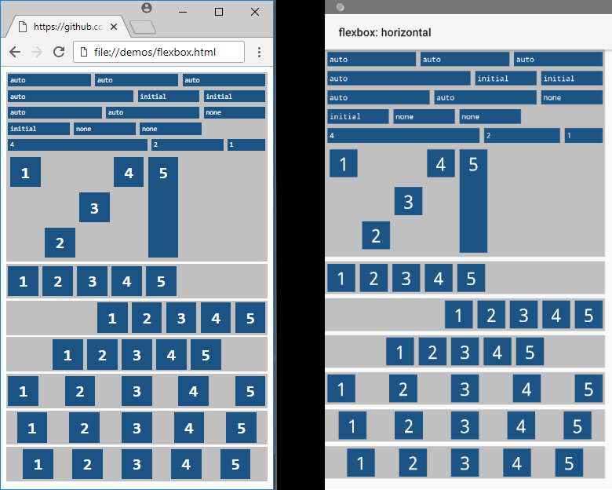

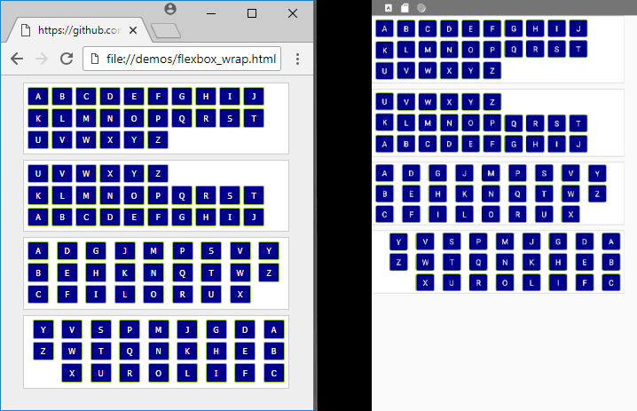

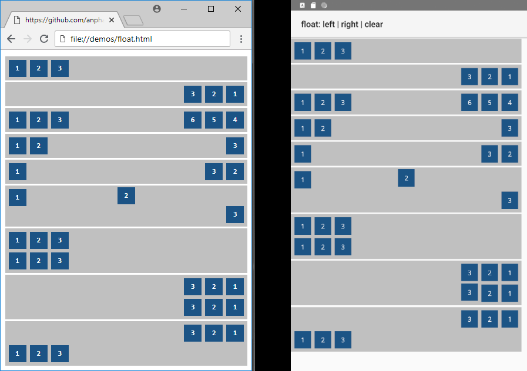

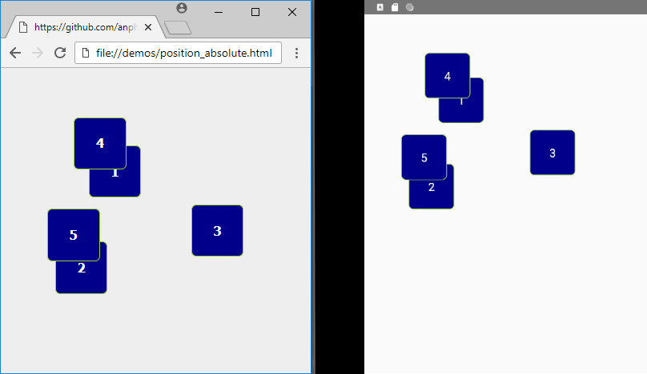

### Extensions: Standard

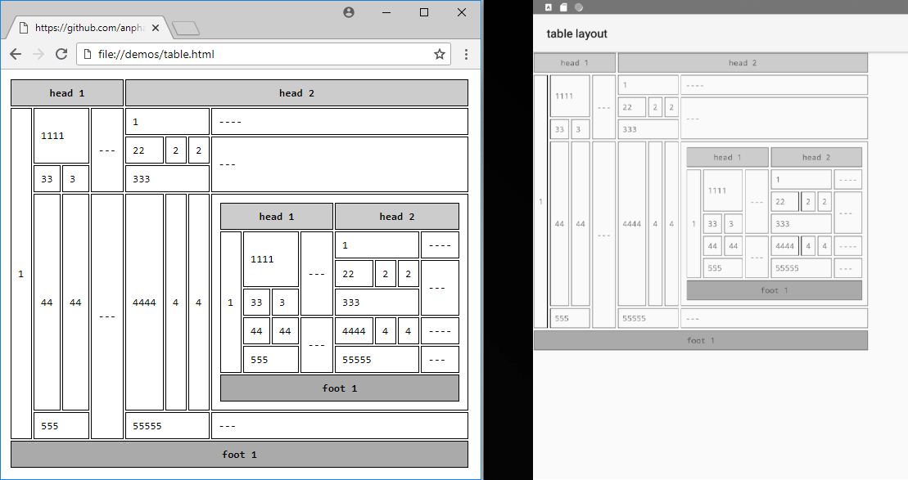

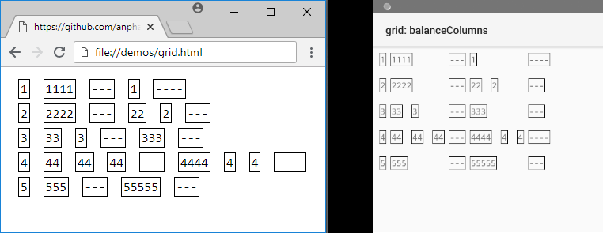

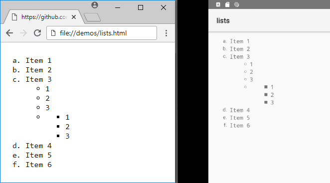

### Extensions: Widgets

Most of the Android support library extensions can be configured using the same attribute name in the Android documentation. See /demo/*.html for usage instructions.

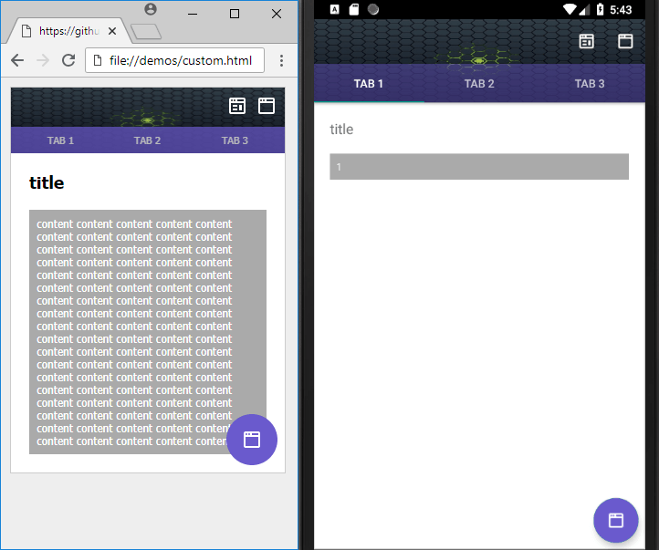

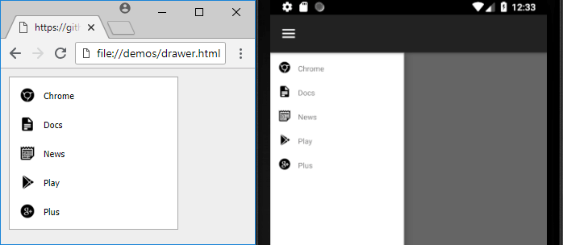

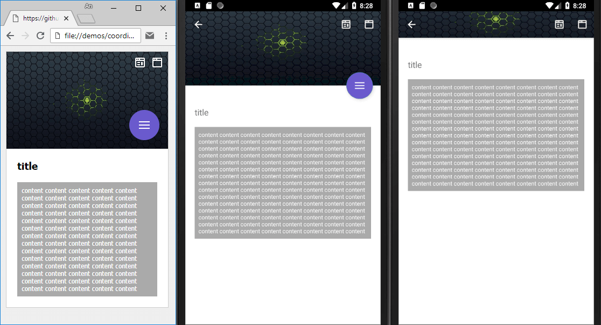

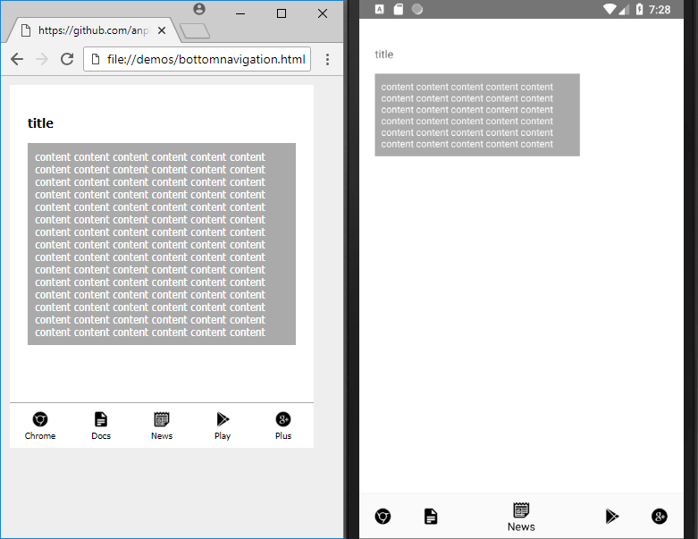

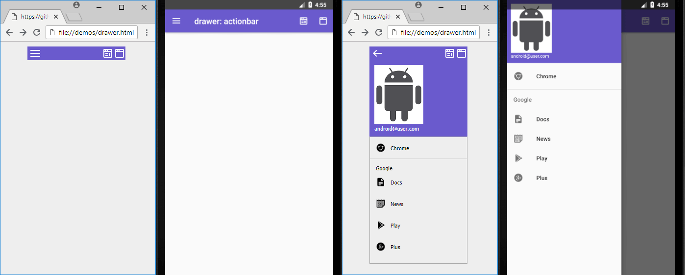

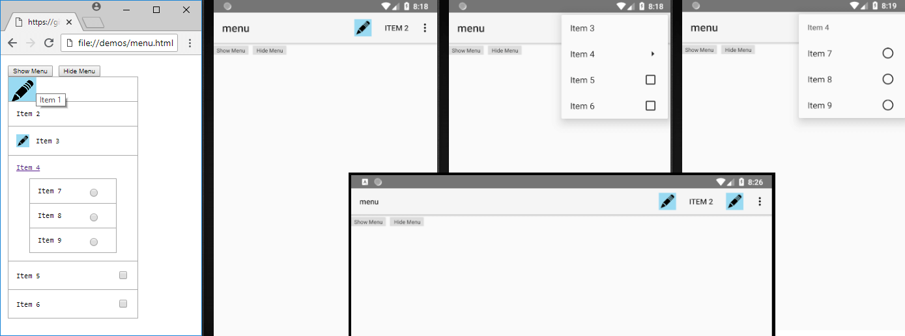

### Extensions: Configuration

```javascript
<script>
    // configure an extension (built-in)
    androme.configureExtension('androme.widget.toolbar', { // optional: default configuration is provided
        'elementId': { // HTML DOM
            appBar: {
                android: {
                    theme: '@style/ThemeOverlay.AppCompat.Dark.ActionBar'
                }
            }
        }
    });

    // create an extension (third-party)
    class Sample extends androme.Extension {
        constructor(name, tagNames = [], options = {}) {
            super(name, tagNames, options);
        }
    }

    // register an extension (third-party)
    var sample = new Sample('your.namespace.sample', ['DIV'], { /* same as configure */ });
    androme.registerExtension(sample);

    // configure an extension (third-party) - same as built-in
</script>
```
### API: Public properties and methods (androme)

There is no official documentation for the time being since this project is still in early development. The entire source code is available on GitHub if you need further clarification.

```javascript
.build // android versions: 14 to 28
.density // dpi
.settings // see user preferences section

customize(build: number, widget: string, options: { android: {}, app: {} }) // global attributes applied to specific views (widget: 'Button' / 'Spinner' / 'namespace.thirdparty.control')

parseDocument() // see installation section

ready() // boolean indicating if parseDocument can be called
close() // close current session preceding write to disk or local output
reset() // clear cached layouts and reopen session

saveAllToDisk() // download entire project as zip archive - requires http://localhost through Node and Express

writeLayoutAllXml(saveToDisk: boolean) // output generated xml
writeResourceAllXml(saveToDisk: boolean)
writeResourceArrayXml(saveToDisk: boolean)
writeResourceColorXml(saveToDisk: boolean)
writeResourceDimenXml(saveToDisk: boolean)
writeResourceDrawableXml(saveToDisk: boolean)
writeResourceFontXml(saveToDisk: boolean)
writeResourceStringXml(saveToDisk: boolean)
writeResourceStyleXml(saveToDisk: boolean)
toString() // activity_main.xml

configureExtension(name: string, options: {}) // see extension configuration section | same: ext(name: string, options: {})
registerExtension(extension: androme.Extension) // see extension configuration section | same: ext(extension: object)
getExtension(name: string) // retrieve an extension by namespace and control | same: ext(name: string)

addXmlNs(name: string, uri: string) // add global namespaces for android third-party controls
```
### Redirecting output location

It is sometimes necessary to append elements into other containers when trying to design a UI which will look identical on the Android device. Redirection will fail if the target "location" is not a block/container element.

```xml
<div>
    <span>Item 1</span>
    <span data-target="location">Item 2</span>
<div>
<ul id="location">
    <li>Item 3</li>
    <!-- span -->
</ul>
```
```xml
<LinearLayout>
    <TextView>Item 1</TextView>
</LinearLayout>
<LinearLayout>
    <TextView>Item 3</TextView>
    <TextView>Item 2</TextView>
</LinearLayout>
```
Using "target" into a ConstraintLayout or RelativeLayout view will not include automatic positioning.

### Excluding or including applied attributes

Most attributes can be excluded from the generated XML using the dataset feature in HTML. One or more can be applied to any tag using the OR "|" operator. These may cause warnings when you compile your project and should only be used in cases when an extension has their custom attributes overwritten.

```xml
<div data-exclude-procedure="LAYOUT | ALIGNMENT | CUSTOMIZATION | ACCESSIBILITY | ALL" data-exclude-resource="BOX_STYLE | BOX_SPACING | FONT_STYLE | VALUE_STRING | OPTION_ARRAY | IMAGE_SOURCE | ASSET | ALL"></div>
<div>
    <span data-exclude-resource="FONT_STYLE">content</span>
    <input id="cb1" type="checkbox" data-exclude-procedure="ACCESSIBILITY"><label for="cb1">checkbox text</label>
</div>
```
```xml
<div
    data-attr-android="layout_width::match_parent;layout_height::match_parent"
    data-attr-app="layout_scrollFlags::scroll|exitUntilCollapsed">
</div>
```
### Using layout includes with merge tag

Some applications can benefit from using includes and merge tags in order share common templates. Nested includes are also supported.

```xml
<div>
    <div>Item 1</div>
    <div data-include="filename1" data-include-merge="true">Item 2</div>
    <div>Item 3</div>
    <div data-include-end="true">Item 4</div>
    <div data-include="filename2" data-include-end="true">Item 5</div>
</div>
```
```xml
<LinearLayout>
    <TextView>Item 1</TextView>
    <include layout="@layout/filename1">
    <include layout="@layout/filename2">
</LinearLayout>
<!-- res/layout/activity_main.xml -->

<merge>
    <TextView>Item 2</TextView>
    <TextView>Item 3</TextView>
    <TextView>Item 4</TextView>
</merge>
<!-- res/layout/filename1.xml -->

<TextView>Item 5</TextView>
<!-- res/layout/filename2.xml -->
```
The attributes "include" and "include-end" can only be applied to elements which share the same parent container. See /demos/custom.html for usage instructions.

### Generated from HTML and CSS

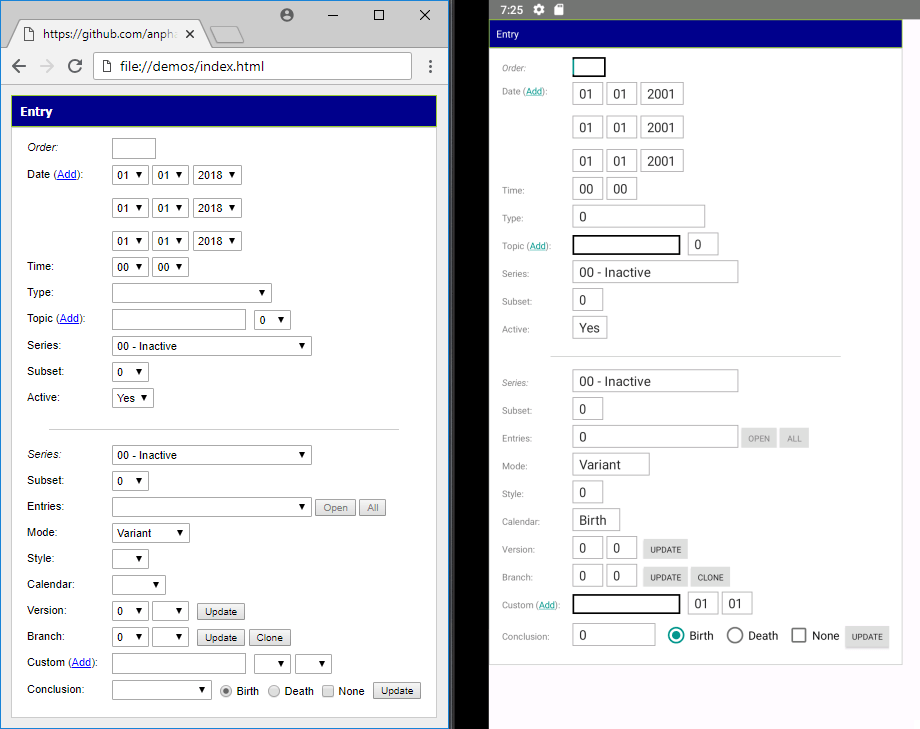 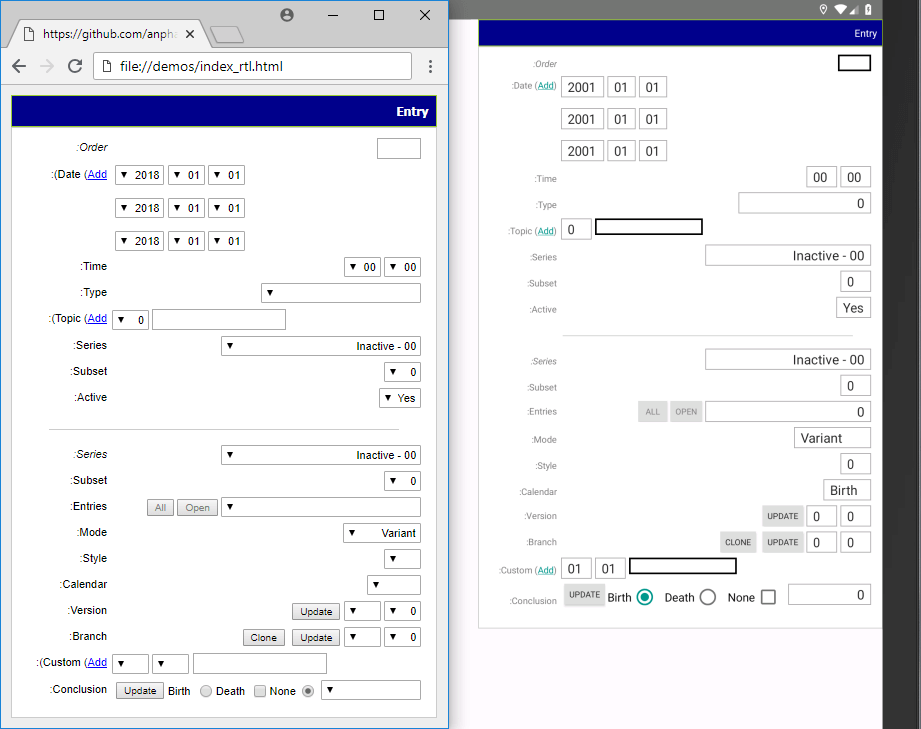

```xml
<?xml version="1.0" encoding="utf-8"?>
<LinearLayout
    xmlns:android="http://schemas.android.com/apk/res/android"
    xmlns:app="http://schemas.android.com/apk/res-auto"
    android:id="@+id/androme_ui"
    android:gravity="top"
    android:layout_height="wrap_content"
    android:layout_width="wrap_content"
    android:orientation="vertical">
    <TextView
        android:id="@+id/textview_1"
        android:background="@drawable/h2_textview_1"
        android:layout_height="wrap_content"
        android:layout_width="match_parent"
        android:padding="@dimen/h2_padding"
        android:text="@string/entry"
        style="@style/H2" />
    <LinearLayout
        android:id="@+id/entry"
        android:background="@drawable/form_entry"
        android:layout_height="wrap_content"
        android:layout_width="wrap_content"
        android:orientation="vertical"
        android:paddingHorizontal="@dimen/form_padding_horizontal"
        android:paddingVertical="@dimen/form_padding_vertical">
        <GridLayout
            android:id="@+id/gridlayout_1"
            android:columnCount="2"
            android:layout_height="wrap_content"
            android:layout_width="match_parent"
            android:paddingBottom="@dimen/ul_padding_bottom"
            android:paddingHorizontal="@dimen/ul_padding_horizontal"
            android:paddingTop="@dimen/ul_padding_top">
            <TextView
                android:id="@+id/textview_2"
                android:labelFor="@+id/order"
                android:layout_height="wrap_content"
                android:layout_marginEnd="@dimen/label_margin_end"
                android:layout_width="@dimen/label_width"
                android:paddingTop="@dimen/label_padding_top"
                android:text="@string/order"
                style="@style/Label_1" />
            <EditText
                android:id="@+id/order"
                android:background="@drawable/text_order"
                android:inputType="text"
                android:layout_height="wrap_content"
                android:layout_width="@dimen/text_width"
                android:paddingVertical="@dimen/text_padding_vertical"
                style="@style/Text" />
            <Space
                android:id="@+id/space_1"
                android:layout_columnSpan="2"
                android:layout_height="@dimen/space_height"
                android:layout_width="match_parent" />
            <TextView
                android:id="@+id/textview_3"
                android:layout_height="wrap_content"
                android:layout_marginEnd="@dimen/label_margin_end"
                android:layout_width="@dimen/label_width"
                android:paddingTop="@dimen/label_padding_top"
                android:text="@string/date_add"
                style="@style/Label" />
            <android.support.constraint.ConstraintLayout
                android:id="@+id/constraintlayout_1"
                android:layout_height="wrap_content"
                android:layout_width="wrap_content">
                <Spinner
                    android:id="@+id/month0"
                    android:entries="@array/month0_array"
                    app:layout_constraintBottom_toTopOf="@+id/month1"
                    app:layout_constraintEnd_toStartOf="@+id/day0"
                    app:layout_constraintHorizontal_bias="0"
                    app:layout_constraintHorizontal_chainStyle="packed"
                    app:layout_constraintStart_toStartOf="parent"
                    app:layout_constraintTop_toTopOf="parent"
                    app:layout_constraintWidth_min="@dimen/select_constraintwidth_min"
                    style="@style/Select.constraintlayout_1" />
                <Spinner
                    android:id="@+id/day0"
                    android:entries="@array/day0_array"
                    android:layout_marginStart="@dimen/select_margin_start"
                    app:layout_constraintBottom_toTopOf="@+id/day1"
                    app:layout_constraintEnd_toStartOf="@+id/year0"
                    app:layout_constraintStart_toEndOf="@+id/month0"
                    app:layout_constraintTop_toTopOf="parent"
                    app:layout_constraintWidth_min="@dimen/select_constraintwidth_min"
                    style="@style/Select.constraintlayout_1" />
                <Spinner
                    android:id="@+id/year0"
                    android:entries="@array/year0_array"
                    android:layout_marginStart="@dimen/select_margin_start"
                    app:layout_constraintBottom_toTopOf="@+id/year1"
                    app:layout_constraintEnd_toEndOf="parent"
                    app:layout_constraintStart_toEndOf="@+id/day0"
                    app:layout_constraintTop_toTopOf="parent"
                    app:layout_constraintWidth_min="@dimen/select_constraintwidth_min"
                    style="@style/Select.constraintlayout_1" />
                <Spinner
                    android:id="@+id/month1"
                    android:entries="@array/month0_array"
                    android:layout_marginTop="@dimen/select_margin_top"
                    app:layout_constraintBottom_toTopOf="@+id/month2"
                    app:layout_constraintEnd_toStartOf="@+id/day1"
                    app:layout_constraintHorizontal_bias="0"
                    app:layout_constraintHorizontal_chainStyle="packed"
                    app:layout_constraintStart_toStartOf="parent"
                    app:layout_constraintTop_toBottomOf="@+id/month0"
                    app:layout_constraintWidth_min="@dimen/select_constraintwidth_min"
                    style="@style/Select.constraintlayout_1" />
                <Spinner
                    android:id="@+id/day1"
                    android:entries="@array/day0_array"
                    android:layout_marginStart="@dimen/select_margin_start"
                    android:layout_marginTop="@dimen/select_margin_top"
                    app:layout_constraintBottom_toTopOf="@+id/day2"
                    app:layout_constraintEnd_toStartOf="@+id/year1"
                    app:layout_constraintStart_toEndOf="@+id/month1"
                    app:layout_constraintTop_toBottomOf="@+id/day0"
                    app:layout_constraintWidth_min="@dimen/select_constraintwidth_min"
                    style="@style/Select.constraintlayout_1" />
                <Spinner
                    android:id="@+id/year1"
                    android:entries="@array/year0_array"
                    android:layout_marginStart="@dimen/select_margin_start"
                    android:layout_marginTop="@dimen/select_margin_top"
                    app:layout_constraintBottom_toTopOf="@+id/year2"
                    app:layout_constraintEnd_toEndOf="parent"
                    app:layout_constraintStart_toEndOf="@+id/day1"
                    app:layout_constraintTop_toBottomOf="@+id/year0"
                    app:layout_constraintWidth_min="@dimen/select_constraintwidth_min"
                    style="@style/Select.constraintlayout_1" />
                <Spinner
                    android:id="@+id/month2"
                    android:entries="@array/month0_array"
                    android:layout_marginTop="@dimen/select_margin_top"
                    app:layout_constraintBottom_toBottomOf="parent"
                    app:layout_constraintEnd_toStartOf="@+id/day2"
                    app:layout_constraintHorizontal_bias="0"
                    app:layout_constraintHorizontal_chainStyle="packed"
                    app:layout_constraintStart_toStartOf="parent"
                    app:layout_constraintTop_toBottomOf="@+id/month1"
                    app:layout_constraintWidth_min="@dimen/select_constraintwidth_min"
                    style="@style/Select.constraintlayout_1" />
                <Spinner
                    android:id="@+id/day2"
                    android:entries="@array/day0_array"
                    android:layout_marginStart="@dimen/select_margin_start"
                    android:layout_marginTop="@dimen/select_margin_top"
                    app:layout_constraintBottom_toBottomOf="parent"
                    app:layout_constraintEnd_toStartOf="@+id/year2"
                    app:layout_constraintStart_toEndOf="@+id/month2"
                    app:layout_constraintTop_toBottomOf="@+id/day1"
                    app:layout_constraintWidth_min="@dimen/select_constraintwidth_min"
                    style="@style/Select.constraintlayout_1" />
                <Spinner
                    android:id="@+id/year2"
                    android:entries="@array/year0_array"
                    android:layout_marginStart="@dimen/select_margin_start"
                    android:layout_marginTop="@dimen/select_margin_top"
                    app:layout_constraintBottom_toBottomOf="parent"
                    app:layout_constraintEnd_toEndOf="parent"
                    app:layout_constraintStart_toEndOf="@+id/day2"
                    app:layout_constraintTop_toBottomOf="@+id/year1"
                    app:layout_constraintWidth_min="@dimen/select_constraintwidth_min"
                    style="@style/Select.constraintlayout_1" />
            </android.support.constraint.ConstraintLayout>
            <Space
                android:id="@+id/space_2"
                android:layout_columnSpan="2"
                android:layout_height="@dimen/space_height"
                android:layout_width="match_parent" />
            <TextView
                android:id="@+id/textview_4"
                android:layout_height="wrap_content"
                android:layout_marginEnd="@dimen/label_margin_end"
                android:layout_width="@dimen/label_width"
                android:paddingTop="@dimen/label_padding_top"
                android:text="@string/time"
                style="@style/Label" />
            <LinearLayout
                android:id="@+id/linearlayout_1"
                android:layout_height="wrap_content"
                android:layout_width="wrap_content"
                android:orientation="horizontal">
                <Spinner
                    android:id="@+id/hour"
                    android:entries="@array/hour_array"
                    style="@style/Select.linearlayout_1" />
                <Spinner
                    android:id="@+id/minute"
                    android:entries="@array/minute_array"
                    android:layout_marginStart="@dimen/select_margin_start"
                    style="@style/Select.linearlayout_1" />
            </LinearLayout>
            <Space
                android:id="@+id/space_13"
                android:layout_columnSpan="2"
                android:layout_height="@dimen/space_height"
                android:layout_width="match_parent" />
            <TextView
                android:id="@+id/textview_5"
                android:layout_height="wrap_content"
                android:layout_marginEnd="@dimen/label_margin_end"
                android:layout_width="@dimen/label_width"
                android:paddingTop="@dimen/label_padding_top"
                android:text="@string/type"
                style="@style/Label" />
            <Spinner
                android:id="@+id/typeofentry"
                android:background="@drawable/select_hour"
                android:entries="@array/typeofentry_array"
                android:layout_height="wrap_content"
                android:layout_width="@dimen/select_width"
                android:minWidth="@dimen/select_minwidth"
                android:paddingVertical="@dimen/select_padding_vertical"
                style="@style/Select" />
            <Space
                android:id="@+id/space_3"
                android:layout_columnSpan="2"
                android:layout_height="@dimen/space_height"
                android:layout_width="match_parent" />
            <TextView
                android:id="@+id/textview_6"
                android:labelFor="@+id/topic0"
                android:layout_height="wrap_content"
                android:layout_marginEnd="@dimen/label_margin_end"
                android:layout_width="@dimen/label_width"
                android:paddingTop="@dimen/label_padding_top"
                android:text="@string/topic_add"
                style="@style/Label" />
            <LinearLayout
                android:id="@+id/linearlayout_2"
                android:layout_height="wrap_content"
                android:layout_width="wrap_content"
                android:orientation="horizontal">
                <EditText
                    android:id="@+id/topic0"
                    android:background="@drawable/text_order"
                    android:inputType="text"
                    android:layout_height="wrap_content"
                    android:layout_marginEnd="@dimen/text_margin_end"
                    android:layout_width="@dimen/text_width_1"
                    android:paddingVertical="@dimen/text_padding_vertical"
                    style="@style/Text" />
                <Spinner
                    android:id="@+id/prominence0"
                    android:background="@drawable/select_hour"
                    android:entries="@array/typeofentry_array"
                    android:layout_height="wrap_content"
                    android:layout_marginStart="@dimen/select_margin_start"
                    android:layout_width="wrap_content"
                    android:minWidth="@dimen/select_minwidth"
                    android:paddingVertical="@dimen/select_padding_vertical"
                    style="@style/Select" />
            </LinearLayout>
            <Space
                android:id="@+id/space_4"
                android:layout_columnSpan="2"
                android:layout_height="@dimen/space_height"
                android:layout_width="match_parent" />
            <TextView
                android:id="@+id/textview_7"
                android:layout_height="wrap_content"
                android:layout_marginEnd="@dimen/label_margin_end"
                android:layout_width="@dimen/label_width"
                android:paddingTop="@dimen/label_padding_top"
                android:text="@string/series"
                style="@style/Label" />
            <Spinner
                android:id="@+id/series"
                android:background="@drawable/select_hour"
                android:entries="@array/series_array"
                android:layout_height="wrap_content"
                android:layout_width="@dimen/select_width_1"
                android:minWidth="@dimen/select_minwidth"
                android:paddingVertical="@dimen/select_padding_vertical"
                style="@style/Select" />
            <Space
                android:id="@+id/space_5"
                android:layout_columnSpan="2"
                android:layout_height="@dimen/space_height"
                android:layout_width="match_parent" />
            <TextView
                android:id="@+id/textview_8"
                android:layout_height="wrap_content"
                android:layout_marginEnd="@dimen/label_margin_end"
                android:layout_width="@dimen/label_width"
                android:paddingTop="@dimen/label_padding_top"
                android:text="@string/subset"
                style="@style/Label" />
            <Spinner
                android:id="@+id/subset"
                android:background="@drawable/select_hour"
                android:entries="@array/typeofentry_array"
                android:layout_height="wrap_content"
                android:layout_width="wrap_content"
                android:minWidth="@dimen/select_minwidth"
                android:paddingVertical="@dimen/select_padding_vertical"
                style="@style/Select" />
            <Space
                android:id="@+id/space_6"
                android:layout_columnSpan="2"
                android:layout_height="@dimen/space_height"
                android:layout_width="match_parent" />
            <TextView
                android:id="@+id/textview_9"
                android:layout_height="wrap_content"
                android:layout_marginEnd="@dimen/label_margin_end"
                android:layout_width="@dimen/label_width"
                android:paddingTop="@dimen/label_padding_top"
                android:text="@string/active"
                style="@style/Label" />
            <Spinner
                android:id="@+id/entryactive"
                android:background="@drawable/select_hour"
                android:entries="@array/entryactive_array"
                android:layout_height="wrap_content"
                android:layout_width="wrap_content"
                android:minWidth="@dimen/select_minwidth"
                android:paddingVertical="@dimen/select_padding_vertical"
                style="@style/Select" />
        </GridLayout>
        <View
            android:id="@+id/view_1"
            android:background="@color/light_gray_1"
            android:layout_gravity="center_horizontal"
            android:layout_height="@dimen/hr_height"
            android:layout_marginHorizontal="@dimen/hr_margin_horizontal"
            android:layout_marginVertical="@dimen/hr_margin_vertical"
            android:layout_width="@dimen/hr_width" />
        <GridLayout
            android:id="@+id/gridlayout_2"
            android:columnCount="2"
            android:layout_height="wrap_content"
            android:layout_width="wrap_content"
            android:paddingBottom="@dimen/ul_padding_bottom"
            android:paddingHorizontal="@dimen/ul_padding_horizontal"
            android:paddingTop="@dimen/ul_padding_top">
            <TextView
                android:id="@+id/textview_10"
                android:layout_height="wrap_content"
                android:layout_marginEnd="@dimen/label_margin_end"
                android:layout_width="@dimen/label_width"
                android:paddingTop="@dimen/label_padding_top"
                android:text="@string/series"
                style="@style/Label_1" />
            <Spinner
                android:id="@+id/series_1"
                android:background="@drawable/select_hour"
                android:entries="@array/series_array"
                android:layout_height="wrap_content"
                android:layout_width="@dimen/select_width_1"
                android:minWidth="@dimen/select_minwidth"
                android:paddingVertical="@dimen/select_padding_vertical"
                style="@style/Select" />
            <Space
                android:id="@+id/space_7"
                android:layout_columnSpan="2"
                android:layout_height="@dimen/space_height"
                android:layout_width="match_parent" />
            <TextView
                android:id="@+id/textview_11"
                android:layout_height="wrap_content"
                android:layout_marginEnd="@dimen/label_margin_end"
                android:layout_width="@dimen/label_width"
                android:paddingTop="@dimen/label_padding_top"
                android:text="@string/subset"
                style="@style/Label" />
            <Spinner
                android:id="@+id/subset_1"
                android:background="@drawable/select_hour"
                android:entries="@array/typeofentry_array"
                android:layout_height="wrap_content"
                android:layout_width="wrap_content"
                android:minWidth="@dimen/select_minwidth"
                android:paddingVertical="@dimen/select_padding_vertical"
                style="@style/Select" />
            <Space
                android:id="@+id/space_8"
                android:layout_columnSpan="2"
                android:layout_height="@dimen/space_height"
                android:layout_width="match_parent" />
            <TextView
                android:id="@+id/textview_12"
                android:layout_height="wrap_content"
                android:layout_marginEnd="@dimen/label_margin_end"
                android:layout_width="@dimen/label_width"
                android:paddingTop="@dimen/label_padding_top"
                android:text="@string/entries"
                style="@style/Label" />
            <LinearLayout
                android:id="@+id/linearlayout_3"
                android:layout_height="wrap_content"
                android:layout_width="wrap_content"
                android:orientation="horizontal">
                <Spinner
                    android:id="@+id/entry_1"
                    android:background="@drawable/select_hour"
                    android:entries="@array/typeofentry_array"
                    android:layout_height="wrap_content"
                    android:layout_width="@dimen/select_width_1"
                    android:minWidth="@dimen/select_minwidth"
                    android:paddingVertical="@dimen/select_padding_vertical"
                    style="@style/Select" />
                <Button
                    android:id="@+id/button_1"
                    android:background="@drawable/button_button_1"
                    android:focusable="false"
                    android:layout_height="wrap_content"
                    android:layout_marginStart="@dimen/button_margin_start"
                    android:layout_width="wrap_content"
                    android:minHeight="@dimen/button_minheight"
                    android:minWidth="@dimen/button_minwidth"
                    android:paddingHorizontal="@dimen/button_padding_horizontal"
                    android:paddingVertical="@dimen/button_padding_vertical"
                    android:text="@string/open"
                    style="@style/Button_1" />
                <Button
                    android:id="@+id/button_2"
                    android:background="@drawable/button_button_1"
                    android:focusable="false"
                    android:layout_height="wrap_content"
                    android:layout_marginStart="@dimen/button_margin_start"
                    android:layout_width="wrap_content"
                    android:minHeight="@dimen/button_minheight"
                    android:minWidth="@dimen/button_minwidth"
                    android:paddingHorizontal="@dimen/button_padding_horizontal"
                    android:paddingVertical="@dimen/button_padding_vertical"
                    android:text="@string/all"
                    style="@style/Button_1" />
            </LinearLayout>
            <Space
                android:id="@+id/space_14"
                android:layout_columnSpan="2"
                android:layout_height="@dimen/space_height"
                android:layout_width="match_parent" />
            <TextView
                android:id="@+id/textview_13"
                android:layout_height="wrap_content"
                android:layout_marginEnd="@dimen/label_margin_end"
                android:layout_width="@dimen/label_width"
                android:paddingTop="@dimen/label_padding_top"
                android:text="@string/mode"
                style="@style/Label" />
            <Spinner
                android:id="@+id/mode"
                android:background="@drawable/select_hour"
                android:entries="@array/mode_array"
                android:layout_height="wrap_content"
                android:layout_width="wrap_content"
                android:minWidth="@dimen/select_minwidth"
                android:paddingVertical="@dimen/select_padding_vertical"
                style="@style/Select" />
            <Space
                android:id="@+id/space_9"
                android:layout_columnSpan="2"
                android:layout_height="@dimen/space_height"
                android:layout_width="match_parent" />
            <TextView
                android:id="@+id/textview_14"
                android:layout_height="wrap_content"
                android:layout_marginEnd="@dimen/label_margin_end"
                android:layout_width="@dimen/label_width"
                android:paddingTop="@dimen/label_padding_top"
                android:text="@string/style"
                style="@style/Label" />
            <Spinner
                android:id="@+id/style1"
                android:background="@drawable/select_hour"
                android:entries="@array/typeofentry_array"
                android:layout_height="wrap_content"
                android:layout_width="wrap_content"
                android:minWidth="@dimen/select_minwidth"
                android:paddingVertical="@dimen/select_padding_vertical"
                style="@style/Select" />
            <Space
                android:id="@+id/space_10"
                android:layout_columnSpan="2"
                android:layout_height="@dimen/space_height"
                android:layout_width="match_parent" />
            <TextView
                android:id="@+id/textview_15"
                android:layout_height="wrap_content"
                android:layout_marginEnd="@dimen/label_margin_end"
                android:layout_width="@dimen/label_width"
                android:paddingTop="@dimen/label_padding_top"
                android:text="@string/calendar"
                style="@style/Label" />
            <Spinner
                android:id="@+id/calendar"
                android:background="@drawable/select_hour"
                android:entries="@array/calendar_array"
                android:layout_height="wrap_content"
                android:layout_width="wrap_content"
                android:minWidth="@dimen/select_minwidth"
                android:paddingVertical="@dimen/select_padding_vertical"
                style="@style/Select" />
            <Space
                android:id="@+id/space_11"
                android:layout_columnSpan="2"
                android:layout_height="@dimen/space_height"
                android:layout_width="match_parent" />
            <TextView
                android:id="@+id/textview_16"
                android:layout_height="wrap_content"
                android:layout_marginEnd="@dimen/label_margin_end"
                android:layout_width="@dimen/label_width"
                android:paddingTop="@dimen/label_padding_top"
                android:text="@string/version"
                style="@style/Label" />
            <LinearLayout
                android:id="@+id/linearlayout_4"
                android:layout_height="wrap_content"
                android:layout_width="wrap_content"
                android:orientation="horizontal">
                <Spinner
                    android:id="@+id/version"
                    android:background="@drawable/select_hour"
                    android:entries="@array/version_array"
                    android:layout_height="wrap_content"
                    android:layout_width="wrap_content"
                    android:minWidth="@dimen/select_minwidth"
                    android:paddingVertical="@dimen/select_padding_vertical"
                    style="@style/Select" />
                <Spinner
                    android:id="@+id/version_update"
                    android:background="@drawable/select_hour"
                    android:entries="@array/version_array"
                    android:layout_height="wrap_content"
                    android:layout_marginStart="@dimen/select_margin_start"
                    android:layout_width="wrap_content"
                    android:minWidth="@dimen/select_minwidth"
                    android:paddingVertical="@dimen/select_padding_vertical"
                    style="@style/Select" />
                <Button
                    android:id="@+id/button_3"
                    android:background="@drawable/button_button_1"
                    android:layout_height="wrap_content"
                    android:layout_marginStart="@dimen/button_margin_start_1"
                    android:layout_width="wrap_content"
                    android:minHeight="@dimen/button_minheight"
                    android:minWidth="@dimen/button_minwidth"
                    android:paddingHorizontal="@dimen/button_padding_horizontal"
                    android:paddingVertical="@dimen/button_padding_vertical"
                    android:text="@string/update"
                    style="@style/Button" />
            </LinearLayout>
            <Space
                android:id="@+id/space_15"
                android:layout_columnSpan="2"
                android:layout_height="@dimen/space_height"
                android:layout_width="match_parent" />
            <TextView
                android:id="@+id/textview_17"
                android:layout_height="wrap_content"
                android:layout_marginEnd="@dimen/label_margin_end"
                android:layout_width="@dimen/label_width"
                android:paddingTop="@dimen/label_padding_top"
                android:text="@string/branch"
                style="@style/Label" />
            <LinearLayout
                android:id="@+id/linearlayout_5"
                android:layout_height="wrap_content"
                android:layout_width="wrap_content"
                android:orientation="horizontal">
                <Spinner
                    android:id="@+id/branch"
                    android:background="@drawable/select_hour"
                    android:entries="@array/branch_array"
                    android:layout_height="wrap_content"
                    android:layout_width="wrap_content"
                    android:minWidth="@dimen/select_minwidth"
                    android:paddingVertical="@dimen/select_padding_vertical"
                    style="@style/Select" />
                <Spinner
                    android:id="@+id/branch_update"
                    android:background="@drawable/select_hour"
                    android:entries="@array/branch_array"
                    android:layout_height="wrap_content"
                    android:layout_marginStart="@dimen/select_margin_start"
                    android:layout_width="wrap_content"
                    android:minWidth="@dimen/select_minwidth"
                    android:paddingVertical="@dimen/select_padding_vertical"
                    style="@style/Select" />
                <Button
                    android:id="@+id/button_4"
                    android:background="@drawable/button_button_1"
                    android:layout_height="wrap_content"
                    android:layout_marginStart="@dimen/button_margin_start_1"
                    android:layout_width="wrap_content"
                    android:minHeight="@dimen/button_minheight"
                    android:minWidth="@dimen/button_minwidth"
                    android:paddingHorizontal="@dimen/button_padding_horizontal"
                    android:paddingVertical="@dimen/button_padding_vertical"
                    android:text="@string/update"
                    style="@style/Button" />
                <Button
                    android:id="@+id/button_5"
                    android:background="@drawable/button_button_1"
                    android:layout_height="wrap_content"
                    android:layout_marginStart="@dimen/button_margin_start"
                    android:layout_width="wrap_content"
                    android:minHeight="@dimen/button_minheight"
                    android:minWidth="@dimen/button_minwidth"
                    android:paddingHorizontal="@dimen/button_padding_horizontal"
                    android:paddingVertical="@dimen/button_padding_vertical"
                    android:text="@string/clone"
                    style="@style/Button" />
            </LinearLayout>
            <Space
                android:id="@+id/space_16"
                android:layout_columnSpan="2"
                android:layout_height="@dimen/space_height"
                android:layout_width="match_parent" />
            <TextView
                android:id="@+id/textview_18"
                android:labelFor="@+id/customname0"
                android:layout_height="wrap_content"
                android:layout_marginEnd="@dimen/label_margin_end"
                android:layout_width="@dimen/label_width"
                android:paddingTop="@dimen/label_padding_top"
                android:text="@string/custom_add"
                style="@style/Label" />
            <LinearLayout
                android:id="@+id/linearlayout_6"
                android:layout_height="wrap_content"
                android:layout_width="wrap_content"
                android:orientation="horizontal">
                <EditText
                    android:id="@+id/customname0"
                    android:background="@drawable/text_order"
                    android:inputType="text"
                    android:layout_height="wrap_content"
                    android:layout_marginEnd="@dimen/text_margin_end"
                    android:layout_width="@dimen/text_width_1"
                    android:paddingVertical="@dimen/text_padding_vertical"
                    style="@style/Text" />
                <Spinner
                    android:id="@+id/custommonth0"
                    android:background="@drawable/select_hour"
                    android:entries="@array/month0_array"
                    android:layout_height="wrap_content"
                    android:layout_marginStart="@dimen/select_margin_start"
                    android:layout_width="wrap_content"
                    android:minWidth="@dimen/select_minwidth"
                    android:paddingVertical="@dimen/select_padding_vertical"
                    style="@style/Select" />
                <Spinner
                    android:id="@+id/customday0"
                    android:background="@drawable/select_hour"
                    android:entries="@array/day0_array"
                    android:layout_height="wrap_content"
                    android:layout_marginStart="@dimen/select_margin_start"
                    android:layout_width="wrap_content"
                    android:minWidth="@dimen/select_minwidth"
                    android:paddingVertical="@dimen/select_padding_vertical"
                    style="@style/Select" />
            </LinearLayout>
            <Space
                android:id="@+id/space_12"
                android:layout_columnSpan="2"
                android:layout_height="@dimen/space_height"
                android:layout_width="match_parent" />
            <TextView
                android:id="@+id/textview_19"
                android:layout_gravity="center_vertical"
                android:layout_height="wrap_content"
                android:layout_marginEnd="@dimen/label_margin_end"
                android:layout_width="@dimen/label_width"
                android:paddingTop="@dimen/label_padding_top"
                android:text="@string/conclusion"
                style="@style/Label" />
            <LinearLayout
                android:id="@+id/linearlayout_7"
                android:layout_height="wrap_content"
                android:layout_width="wrap_content"
                android:orientation="horizontal">
                <Spinner
                    android:id="@+id/person"
                    android:background="@drawable/select_hour"
                    android:entries="@array/typeofentry_array"
                    android:layout_gravity="center_vertical"
                    android:layout_height="wrap_content"
                    android:layout_width="@dimen/select_width_2"
                    android:minWidth="@dimen/select_minwidth"
                    android:paddingVertical="@dimen/select_padding_vertical"
                    style="@style/Select" />
                <LinearLayout
                    android:id="@+id/linearlayout_8"
                    android:layout_gravity="center_vertical"
                    android:layout_height="wrap_content"
                    android:layout_marginStart="@dimen/div_margin_start"
                    android:layout_width="wrap_content"
                    android:orientation="horizontal">
                    <RadioGroup
                        android:id="@+id/radiogroup_1"
                        android:checkedButton="@+id/c2"
                        android:orientation="horizontal"
                        style="@style/linearlayout_8">
                        <RadioButton
                            android:id="@+id/c2"
                            android:layout_marginStart="@dimen/radio_margin_start"
                            android:text="@string/birth"
                            style="@style/radiogroup_1" />
                        <RadioButton
                            android:id="@+id/c3"
                            android:layout_marginStart="@dimen/radio_margin_start_1"
                            android:text="@string/death"
                            style="@style/radiogroup_1" />
                    </RadioGroup>
                    <CheckBox
                        android:id="@+id/c4"
                        android:layout_marginEnd="@dimen/checkbox_margin_end"
                        android:layout_marginStart="@dimen/checkbox_margin_start"
                        android:layout_marginVertical="@dimen/checkbox_margin_vertical"
                        android:text="@string/none"
                        style="@style/linearlayout_8" />
                </LinearLayout>
                <Button
                    android:id="@+id/button_6"
                    android:background="@drawable/button_button_1"
                    android:layout_gravity="center_vertical"
                    android:layout_height="wrap_content"
                    android:layout_marginStart="@dimen/button_margin_start"
                    android:layout_width="wrap_content"
                    android:minHeight="@dimen/button_minheight"
                    android:minWidth="@dimen/button_minwidth"
                    android:paddingHorizontal="@dimen/button_padding_horizontal"
                    android:paddingVertical="@dimen/button_padding_vertical"
                    android:text="@string/update"
                    style="@style/Button" />
            </LinearLayout>
        </GridLayout>
    </LinearLayout>
</LinearLayout>
```
### String Resources

```xml
<?xml version="1.0" encoding="utf-8"?>
<resources>
    <string name="app_name">androme_ui</string>
    <string name="__00_inactive">00 - Inactive</string>
    <string name="__01_active">01 - Active</string>
    <string name="active">Active:</string>
    <string name="all">All</string>
    <string name="birth">Birth</string>
    <string name="branch">Branch:</string>
    <string name="calendar">Calendar:</string>
    <string name="clone">Clone</string>
    <string name="conclusion">Conclusion:</string>
    <string name="custom_add">Custom (<a href="#">Add</a>):</string>
    <string name="date_add">Date (<a href="#">Add</a>):</string>
    <string name="death">Death</string>
    <string name="entries">Entries:</string>
    <string name="entry">Entry</string>
    <string name="mode">Mode:</string>
    <string name="no">No</string>
    <string name="none">None</string>
    <string name="open">Open</string>
    <string name="order">Order:</string>
    <string name="predefined">Predefined</string>
    <string name="series">Series:</string>
    <string name="style">Style:</string>
    <string name="subset">Subset:</string>
    <string name="time">Time:</string>
    <string name="topic_add">Topic (<a href="#">Add</a>):</string>
    <string name="type">Type:</string>
    <string name="update">Update</string>
    <string name="variant">Variant</string>
    <string name="version">Version:</string>
    <string name="yes">Yes</string>
</resources>
<!-- filename: res/values/strings.xml -->
```
```xml
<?xml version="1.0" encoding="utf-8"?>
<resources>
    <string-array name="branch_array">
        <item>0</item>
        <item>1</item>
        <item>2</item>
        <item>3</item>
        <item>4</item>
        <item>5</item>
        <item>6</item>
        <item>7</item>
        <item>8</item>
        <item>9</item>
        <item>10</item>
    </string-array>
    <string-array name="calendar_array">
        <item>@string/birth</item>
        <item>@string/death</item>
    </string-array>
    <string-array name="day0_array">
        <item>01</item>
        <item>02</item>
        <item>03</item>
        <item>04</item>
        <item>05</item>
        <item>06</item>
        <item>07</item>
        <item>08</item>
        <item>09</item>
        <item>10</item>
        <item>11</item>
        <item>12</item>
        <item>13</item>
        <item>14</item>
        <item>15</item>
        <item>16</item>
        <item>17</item>
        <item>18</item>
        <item>19</item>
        <item>20</item>
        <item>21</item>
        <item>22</item>
        <item>23</item>
        <item>24</item>
        <item>25</item>
        <item>26</item>
        <item>27</item>
        <item>28</item>
        <item>29</item>
        <item>30</item>
        <item>31</item>
    </string-array>
    <string-array name="entryactive_array">
        <item>@string/yes</item>
        <item>@string/no</item>
    </string-array>
    <string-array name="hour_array">
        <item>00</item>
        <item>01</item>
        <item>02</item>
        <item>03</item>
        <item>04</item>
        <item>05</item>
        <item>06</item>
        <item>07</item>
        <item>08</item>
        <item>09</item>
        <item>10</item>
        <item>11</item>
        <item>12</item>
        <item>13</item>
        <item>14</item>
        <item>15</item>
        <item>16</item>
        <item>17</item>
        <item>18</item>
        <item>19</item>
        <item>20</item>
        <item>21</item>
        <item>22</item>
        <item>23</item>
    </string-array>
    <string-array name="minute_array">
        <item>00</item>
        <item>15</item>
        <item>30</item>
        <item>45</item>
    </string-array>
    <string-array name="mode_array">
        <item>@string/variant</item>
        <item>@string/predefined</item>
    </string-array>
    <string-array name="month0_array">
        <item>01</item>
        <item>02</item>
        <item>03</item>
        <item>04</item>
        <item>05</item>
        <item>06</item>
        <item>07</item>
        <item>08</item>
        <item>09</item>
        <item>10</item>
        <item>11</item>
        <item>12</item>
    </string-array>
    <string-array name="series_array">
        <item>@string/__00_inactive</item>
        <item>@string/__01_active</item>
    </string-array>
    <string-array name="typeofentry_array">
        <item>0</item>
        <item>1</item>
    </string-array>
    <string-array name="version_array">
        <item>0</item>
        <item>1</item>
        <item>2</item>
    </string-array>
    <string-array name="year0_array">
        <item>2001</item>
        <item>2002</item>
        <item>2003</item>
        <item>2004</item>
        <item>2005</item>
        <item>2006</item>
        <item>2007</item>
        <item>2008</item>
        <item>2009</item>
        <item>2010</item>
        <item>2011</item>
        <item>2012</item>
        <item>2013</item>
        <item>2014</item>
        <item>2015</item>
        <item>2016</item>
        <item>2017</item>
        <item>2018</item>
    </string-array>
</resources>
<!-- filename: res/values/string_arrays.xml -->
```
### Color Resources

```xml
<?xml version="1.0" encoding="utf-8"?>
<resources>
    <color name="black">#000000</color>
    <color name="dark_blue">#00008B</color>
    <color name="gray">#808080</color>
    <color name="yellow_green">#9ACD32</color>
    <color name="dark_gray">#A9A9A9</color>
    <color name="light_gray_1">#CCCCCC</color>
    <color name="white_smoke_1">#DDDDDD</color>
    <color name="white">#FFFFFF</color>
</resources>
<!-- filename: res/values/colors.xml -->
```
### Styles and Themes

```xml
<?xml version="1.0" encoding="utf-8"?>
<resources>
    <style name="Button">
        <item name="android:background">@color/white_smoke_1</item>
        <item name="android:fontFamily">arial</item>
        <item name="android:textSize">10sp</item>
    </style>
    <style name="Button_1" parent="Button">
        <item name="android:textColor">@color/gray</item>
    </style>
    <style name="H2">
        <item name="android:background">@color/dark_blue</item>
        <item name="android:fontFamily">tahoma</item>
        <item name="android:fontWeight">700</item>
        <item name="android:textColor">@color/white</item>
        <item name="android:textSize">12sp</item>
    </style>
    <style name="Label">
        <item name="android:fontFamily">arial</item>
        <item name="android:textSize">11sp</item>
    </style>
    <style name="Label_1" parent="Label">
        <item name="android:textStyle">italic</item>
    </style>
    <style name="linearlayout_8">
        <item name="android:layout_height">wrap_content</item>
        <item name="android:layout_width">wrap_content</item>
    </style>
    <style name="radiogroup_1">
        <item name="android:layout_height">wrap_content</item>
        <item name="android:layout_marginEnd">@dimen/radio_margin_end</item>
        <item name="android:layout_marginTop">@dimen/radio_margin_top</item>
        <item name="android:layout_width">wrap_content</item>
    </style>
    <style name="Select">
        <item name="android:fontFamily">arial</item>
        <item name="android:textSize">11sp</item>
    </style>
    <style name="Select.constraintlayout_1">
        <item name="android:background">@drawable/select_hour</item>
        <item name="android:layout_height">wrap_content</item>
        <item name="android:layout_width">wrap_content</item>
        <item name="android:paddingVertical">@dimen/select_padding_vertical</item>
    </style>
    <style name="Select.linearlayout_1">
        <item name="android:background">@drawable/select_hour</item>
        <item name="android:layout_height">wrap_content</item>
        <item name="android:layout_width">wrap_content</item>
        <item name="android:minWidth">@dimen/select_minwidth</item>
        <item name="android:paddingVertical">@dimen/select_padding_vertical</item>
    </style>
    <style name="Text">
        <item name="android:fontFamily">arial</item>
        <item name="android:textSize">13sp</item>
    </style>
</resources>
<!-- filename: res/values/styles.xml -->
```
### Bundled Fonts

```xml
<?xml version="1.0" encoding="utf-8"?>
<font-family xmlns:android="http://schemas.android.com/apk/res/android">
    <font android:fontStyle="italic" android:fontWeight="400" android:font="@font/arial_italic" />
    <font android:fontStyle="normal" android:fontWeight="400" android:font="@font/arial_normal" />
</font-family>
<!-- filename: res/font/arial.xml -->

<?xml version="1.0" encoding="utf-8"?>
<font-family xmlns:android="http://schemas.android.com/apk/res/android">
    <font android:fontStyle="normal" android:fontWeight="700" android:font="@font/tahoma_bold" />
</font-family>
<!-- filename: res/font/tahoma.xml -->
```
### Dimension Resources

```xml
<?xml version="1.0" encoding="utf-8"?>
<resources>
    <dimen name="button_margin_start">4dp</dimen>
    <dimen name="button_margin_start_1">8dp</dimen>
    <dimen name="button_minheight">25dp</dimen>
    <dimen name="button_minwidth">35dp</dimen>
    <dimen name="button_padding_horizontal">6dp</dimen>
    <dimen name="button_padding_vertical">1dp</dimen>
    <dimen name="checkbox_margin_end">3dp</dimen>
    <dimen name="checkbox_margin_start">6dp</dimen>
    <dimen name="checkbox_margin_vertical">3dp</dimen>
    <dimen name="div_margin_start">4dp</dimen>
    <dimen name="form_padding_horizontal">10dp</dimen>
    <dimen name="form_padding_vertical">5dp</dimen>
    <dimen name="h2_padding">8dp</dimen>
    <dimen name="hr_height">1dp</dimen>
    <dimen name="hr_margin_horizontal">27dp</dimen>
    <dimen name="hr_margin_vertical">10dp</dimen>
    <dimen name="hr_width">350dp</dimen>
    <dimen name="label_margin_end">5dp</dimen>
    <dimen name="label_padding_top">3dp</dimen>
    <dimen name="label_width">80dp</dimen>
    <dimen name="radio_margin_end">3dp</dimen>
    <dimen name="radio_margin_start">5dp</dimen>
    <dimen name="radio_margin_start_1">7dp</dimen>
    <dimen name="radio_margin_top">3dp</dimen>
    <dimen name="select_constraintwidth_min">37dp</dimen>
    <dimen name="select_margin_start">4dp</dimen>
    <dimen name="select_margin_top">13dp</dimen>
    <dimen name="select_minwidth">37dp</dimen>
    <dimen name="select_padding_vertical">2dp</dimen>
    <dimen name="select_width">160dp</dimen>
    <dimen name="select_width_1">200dp</dimen>
    <dimen name="select_width_2">100dp</dimen>
    <dimen name="space_height">6dp</dimen>
    <dimen name="text_margin_end">5dp</dimen>
    <dimen name="text_padding_vertical">1dp</dimen>
    <dimen name="text_width">40dp</dimen>
    <dimen name="text_width_1">130dp</dimen>
    <dimen name="ul_padding_bottom">11dp</dimen>
    <dimen name="ul_padding_horizontal">5dp</dimen>
    <dimen name="ul_padding_top">5dp</dimen>
</resources>
<!-- filename: res/values/dimens.xml -->
```
### Drawable Resources

```xml
<?xml version="1.0" encoding="utf-8"?>
<shape xmlns:android="http://schemas.android.com/apk/res/android" android:shape="rectangle">
    <stroke android:width="1dp" android:color="@color/yellow_green" />
    <solid android:color="@color/dark_blue" />
</shape>
<!-- filename: res/drawable/h2_textview_1.xml -->

<?xml version="1.0" encoding="utf-8"?>
<shape xmlns:android="http://schemas.android.com/apk/res/android" android:shape="rectangle">
    <stroke android:width="1dp" android:color="@color/light_gray_1" />
    <solid android:color="@color/white" />
</shape>
<!-- filename: res/drawable/form_entry.xml -->

<?xml version="1.0" encoding="utf-8"?>
<shape xmlns:android="http://schemas.android.com/apk/res/android" android:shape="rectangle">
    <stroke android:width="2dp" android:color="@color/black" />
</shape>
<!-- filename: res/drawable/text_order.xml -->

<?xml version="1.0" encoding="utf-8"?>
<shape xmlns:android="http://schemas.android.com/apk/res/android" android:shape="rectangle">
    <stroke android:width="1dp" android:color="@color/dark_gray" />
</shape>
<!-- filename: res/drawable/select_hour.xml -->

<?xml version="1.0" encoding="utf-8"?>
<shape xmlns:android="http://schemas.android.com/apk/res/android" android:shape="rectangle">
    <stroke android:width="2dp" android:color="@color/white_smoke_1" />
    <solid android:color="@color/white_smoke_1" />
</shape>
<!-- filename: res/drawable/button_button_1.xml -->
```
### User Written HTML

Using excessive DIV and FORM tags are not required for mobile devices which can cause additional LinearLayouts to be auto-generated. Block level elements are almost always rendered in order to preserve any CSS styles which are applied to the tag.

https://www.w3.org/TR/html401/struct/global.html#h-7.5.3

If you plan on using this library it adheres to strict HTML validation rules regarding "block-level" and "inline" elements. Any HTML elements with free-form text might be collapsed into a TextView rather than a LinearLayout. Try to enclose everything inside an HTML container otherwise the text might be discarded. You can basically code the HTML any way you want although using reasonable techniques for mobile devices will lead you to a more accurate layout.

RECOMMENDED
```xml
<div>
    <span>abcde</span>
    <span>fghij</span>
    <span>klmno</span>
</div>
```
NOT RECOMMENDED
```xml
<span>
    abcde
    <div>fghij</div>
    klmno
</span>
```
You can use the examples in /demos/*.html to preview some features of this library.